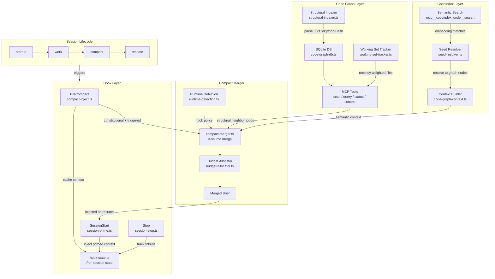
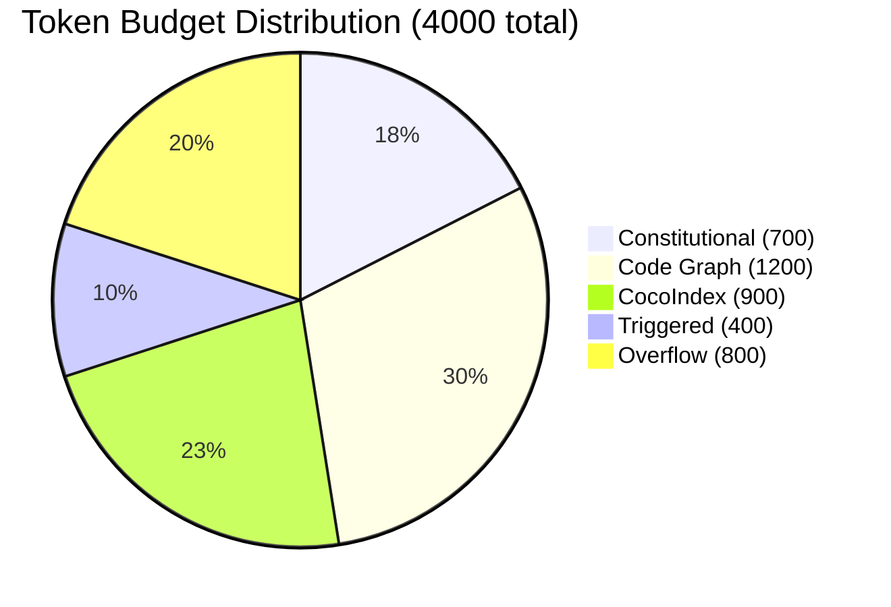

# Architecture Boundaries: system-spec-kit

> Canonical ownership contract between `scripts/` and `mcp_server/` defining allowed dependency directions, build boundaries, exception governance and enforcement tooling.

---

<!-- ANCHOR:table-of-contents -->
## TABLE OF CONTENTS

- [1. OVERVIEW](#1--overview)
- [2. QUICK START](#2--quick-start)
- [3. STRUCTURE](#3--structure)
- [4. FEATURES](#4--features)
- [5. CONFIGURATION](#5--configuration)
- [6. USAGE EXAMPLES](#6--usage-examples)
- [7. TROUBLESHOOTING](#7--troubleshooting)
- [8. FAQ](#8--faq)
- [9. RELATED DOCUMENTS](#9--related-documents)
- [10. HOOK + CODE GRAPH + COCOINDEX ARCHITECTURE](#10--hook--code-graph--cocoindex-architecture)

<!-- /ANCHOR:table-of-contents -->
---

<!-- ANCHOR:overview -->
## 1. OVERVIEW

### What Are Architecture Boundaries?

The `system-spec-kit` codebase splits into three ownership zones: **build-time scripts**, **runtime MCP server** and **shared modules**. Each zone has a clear purpose and strict import rules that prevent coupling between build-time and runtime code.

The `mcp_server/api/` surface acts as the stable boundary. Scripts that need runtime functionality must import through `api/` or `shared/`, never from internal runtime directories.

See ADR-001 in the spec folder for the full decision rationale.

### Key Statistics

| Metric | Value | Details |
|--------|-------|---------|
| Ownership zones | 3 | Scripts, MCP Server, Shared |
| Public boundary | 1 | `mcp_server/api/` |
| Enforcement tools | 9 | AST checkers, CI workflow, boundary scripts |
| Active exceptions | 4 | Registered in allowlist with expiry tracking |

### Key Features

| Feature | Description |
|---------|-------------|
| **Ownership Matrix** | Clear zone assignments for every directory |
| **Dependency Rules** | Allowed and forbidden import directions with rationale |
| **Exception Governance** | Registered exceptions with owner, reason and expiry |
| **Enforcement Tooling** | AST-level and regex-level boundary checkers plus CI |

### Requirements

| Requirement | Minimum | Recommended |
|-------------|---------|-------------|
| TypeScript | 5.0+ | 5.3+ |
| Node.js | 18+ | 20+ |

<!-- /ANCHOR:overview -->
---

<!-- ANCHOR:quick-start -->
## 2. QUICK START

### Import Decision Guide

```
Need to import from another zone?
├─ From scripts/ to shared/              → ALLOWED
├─ From scripts/ to mcp_server/api/*     → ALLOWED (preferred)
├─ From scripts/ to mcp_server/lib/*     → FORBIDDEN (use api/ or shared/)
├─ From scripts/ to mcp_server/core/*    → FORBIDDEN (use api/)
├─ From scripts/ to mcp_server/handlers/ → FORBIDDEN (use api/)
├─ From mcp_server/ to shared/           → ALLOWED
├─ From mcp_server/scripts/ to scripts/dist/* → ALLOWED (wrappers only)
└─ From mcp_server/lib/ to mcp_server/api/   → FORBIDDEN (api wraps lib)
```

### Verify Boundaries

```bash
# Run all boundary checks
npx tsx scripts/evals/check-no-mcp-lib-imports.ts
npx tsx scripts/evals/check-no-mcp-lib-imports-ast.ts
npx tsx scripts/evals/check-handler-cycles-ast.ts

# Expected output:
# No forbidden imports detected
```

<!-- /ANCHOR:quick-start -->
---

<!-- ANCHOR:structure -->
## 3. STRUCTURE

```
system-spec-kit/
├── scripts/                    # Build-time CLI: generation, indexing, evals
│   └── evals/                  # Boundary enforcement scripts and allowlist
├── mcp_server/                 # Runtime: handlers, search, scoring, storage
│   ├── api/                    # Public boundary surface (stable)
│   ├── lib/                    # Internal runtime (private)
│   ├── core/                   # Bootstrap (private)
│   ├── handlers/               # Request handlers (private)
│   └── scripts/                # Compatibility wrappers (delegating only)
├── shared/                     # Neutral: reusable modules for both zones
└── */dist/                     # Generated build output (never source of truth)
```

### Key Files

| File | Purpose |
|------|---------|
| `scripts/evals/import-policy-allowlist.json` | Registered exceptions with ownership metadata |
| `scripts/evals/check-no-mcp-lib-imports.ts` | Regex-level import policy checker |
| `scripts/evals/check-no-mcp-lib-imports-ast.ts` | AST-level import policy checker |
| `scripts/evals/check-handler-cycles-ast.ts` | Circular import detector for handlers |
| `scripts/evals/check-architecture-boundaries.ts` | Shared neutrality and wrapper verification |
| `scripts/check-api-boundary.sh` | API boundary direction check |

<!-- /ANCHOR:structure -->
---

<!-- ANCHOR:features -->
## 4. FEATURES

### Ownership Zones

Each zone has a clear owner and purpose. Cross-zone imports follow strict directional rules.

| Area | Owner | Purpose |
|------|-------|---------|
| `scripts/` | Build-time / CLI | Generation, indexing orchestration, eval runners, operational scripts |
| `mcp_server/` | Runtime | Request handlers, search, scoring, storage, MCP tools |
| `shared/` | Neutral | Reusable modules consumed by both `scripts/` and `mcp_server/` |
| `mcp_server/api/` | Public boundary | Stable surface for external consumers (scripts, evals, automation) |
| `mcp_server/scripts/` | Compatibility | Wrappers delegating to canonical `scripts/` implementations |
| `*/dist/` | Generated | Runtime JavaScript from `tsc --build`. Never the source of truth |

### Dependency Rules

**Allowed directions:**

| From | To | Status |
|------|----|--------|
| `scripts/` | `shared/` | Allowed |
| `scripts/` | `mcp_server/api/*` | Allowed (preferred) |
| `mcp_server/` | `shared/` | Allowed |
| `mcp_server/scripts/` | `scripts/dist/*` | Allowed (compatibility wrappers only) |

**Forbidden directions:**

| From | To | Why |
|------|----|-----|
| `scripts/` | `mcp_server/lib/*` | Use `api/` or `shared/` instead |
| `scripts/` | `mcp_server/core{,/*}` | Runtime bootstrap stays behind `api/` |
| `scripts/` | `mcp_server/handlers{,/*}` | Runtime handlers stay behind `api/` |
| `mcp_server/lib/` | `mcp_server/api/` | `api/` wraps `lib/`, not the reverse |

### Build Artifact Rule (Dist Policy)

`dist/` directories under `shared/`, `scripts/` and `mcp_server/` are generated build outputs produced from TypeScript sources via the build process (`tsc --build`). They can run at runtime, but they are not source-of-truth code or documentation and should not be committed to version control. Edit the authored `.ts` and `.md` files in package roots, then rebuild. Scripts or documentation that reference `dist/` files for execution (e.g., `node scripts/dist/memory/generate-context.js`) are referencing the generated runtime entry point, not canonical source.

#### No Symlinks in lib/ Tree

**Policy**: No symlinks are permitted within `mcp_server/lib/`. All import paths must resolve through real filesystem paths.

**Rationale**: Symlinks create invisible indirection that breaks grep, IDE navigation, dead-code analysis, and static dependency tooling.

**Enforcement**: Visual inspection and `find -type l` checks during code review.

#### Source-Dist Alignment Enforcement

**Policy**: Every `.js` file in `mcp_server/dist/lib/` must have a corresponding `.ts` source file.

**Rationale**: Source files can be silently lost while compiled `dist/` output persists, creating orphaned artifacts.

**Enforcement**: `scripts/evals/check-source-dist-alignment.ts` (run via `npm run check --workspace=scripts` and the boundary-enforcement CI workflow).

### Test Placement Rule

Keep authored tests with the package they verify. Runtime behavior belongs under `mcp_server/tests/`. Do not add hand-written tests under any `dist/` directory. Validate generated output by building from source and running source-owned tests or smoke commands.

### Exception Governance

All exceptions must be registered in `scripts/evals/import-policy-allowlist.json`. Each entry requires owner, reason and expiry tracking.

**Current exceptions:**

| File | Import | Reason |
|------|--------|--------|
| `scripts/evals/run-performance-benchmarks.ts` | `@spec-kit/mcp-server/lib/*` (multiple) | Benchmark needs direct access to internal metrics |
| `scripts/spec-folder/generate-description.ts` | `@spec-kit/mcp-server/lib/search/folder-discovery` | CLI tool needs folder-discovery internals for description generation |
| `scripts/core/workflow.ts` | `@spec-kit/mcp-server/lib/search/folder-discovery` | Workflow memory-save updates per-folder description.json via dynamic import |
| `scripts/memory/rebuild-auto-entities.ts` | `@spec-kit/mcp-server/lib/*` | Entity rebuilder needs direct access to internal storage and indexing modules |

**Removal criteria:** Remove an allowlist entry when its `removeWhen` condition has been satisfied or its `expiresAt` date has passed.

**Removal process:**

1. **Review**: Allowlist `owner` plus at least one `system-spec-kit` maintainer must approve
2. **Migrate**: Delete or narrow the allowlist entry, then move caller imports to `mcp_server/api/*` or `shared/*`
3. **Verify**: Run `check-no-mcp-lib-imports.ts`, re-run affected evals, update `lastReviewedAt` for retained exceptions

### Compatibility Wrappers

`mcp_server/scripts/` contains **only** compatibility wrappers that delegate to canonical implementations in `scripts/`. These are not canonical scripts. See `mcp_server/scripts/README.md`.

**Removal criteria:** Remove a wrapper when all known consumers have migrated to canonical `scripts/` entry points and a 2-sprint cool-down has passed with no rollback.

**Removal process:**

1. **Review**: `system-spec-kit` maintainers and owning runtime/scripts maintainers
2. **Remove**: Delete wrapper files, update docs/runbooks, remove stale references
3. **Verify**: Run canonical entry points, confirm no references remain (`rg "mcp_server/scripts/<name>"`), confirm CI passes

### Shared Module Policy

`shared/` modules must be stable. Breaking changes require coordination with both consumers (`scripts/` and `mcp_server/`). See `shared/README.md` for module inventory and import conventions.

### Enforcement Tooling

| Tool | Path | Purpose |
|------|------|---------|
| Import-policy checker | `scripts/evals/check-no-mcp-lib-imports.ts` | Detects direct `scripts/` imports of internal runtime paths |
| AST import-policy checker | `scripts/evals/check-no-mcp-lib-imports-ast.ts` | AST-level detection for direct and transitive internal imports |
| AST handler-cycle checker | `scripts/evals/check-handler-cycles-ast.ts` | Detects circular imports across `mcp_server/handlers/` |
| Allowlist | `scripts/evals/import-policy-allowlist.json` | Registered exceptions with ownership metadata |
| API boundary check | `scripts/check-api-boundary.sh` | Checks `lib/` to `api/` direction |
| Architecture boundary check | `scripts/evals/check-architecture-boundaries.ts` | `shared/` neutrality + wrapper-only verification |
| CI workflow | `.github/workflows/system-spec-kit-boundary-enforcement.yml` | Runs boundary checks on PRs and pushes |

<!-- /ANCHOR:features -->
---

<!-- ANCHOR:configuration -->
## 5. CONFIGURATION

### Exception Allowlist Format

**Location**: `scripts/evals/import-policy-allowlist.json`

```json
{
  "exceptions": [
    {
      "file": "scripts/evals/run-performance-benchmarks.ts",
      "import": "@spec-kit/mcp-server/lib/*",
      "owner": "spec-kit-maintainers",
      "reason": "Benchmark needs direct access to internal metrics",
      "removeWhen": "api/ exposes benchmark metrics",
      "createdAt": "2026-01-15",
      "lastReviewedAt": "2026-03-01"
    }
  ]
}
```

### Allowlist Fields

| Field | Required | Description |
|-------|----------|-------------|
| `owner` | Yes | Team or individual responsible |
| `reason` | Yes | Why the exception exists |
| `removeWhen` | Yes | Condition for removing the exception |
| `createdAt` | Yes | ISO date when exception was created |
| `lastReviewedAt` | Yes | ISO date of last review |
| `expiresAt` | Wildcard only | ISO date for sunset (required for wildcard internal-runtime entries) |

<!-- /ANCHOR:configuration -->
---

<!-- ANCHOR:usage-examples -->
## 6. USAGE EXAMPLES

### Example 1: Script Importing Through the Public API

```typescript
// scripts/core/workflow.ts
import { hybridSearchEnhanced } from '@spec-kit/mcp-server/api/search';
// Imports through the public API boundary
```

**Result**: Valid import. Passes all boundary checks.

### Example 2: Forbidden Direct Import from Internal Lib

```typescript
// scripts/core/workflow.ts
import { internalScorer } from '@spec-kit/mcp-server/lib/search/scorer';
// FORBIDDEN: Direct import of internal runtime module
// Fix: Use the api/ export or move shared logic to shared/
```

**Result**: Blocked by `check-no-mcp-lib-imports.ts` and CI.

### Example 3: Shared Module Used by Both Zones

```typescript
// scripts/lib/indexer.ts
import { adaptiveFusion } from '@spec-kit/shared/algorithms/adaptive-fusion';
// Both zones can import from shared/

// mcp_server/lib/search/pipeline.ts
import { adaptiveFusion } from '@spec-kit/shared/algorithms/adaptive-fusion';
// Both zones can import from shared/
```

**Result**: Valid imports. `shared/` is neutral ground for both consumers.

### Common Patterns

| Pattern | Import Path | When to Use |
|---------|-------------|-------------|
| Script needs search | `@spec-kit/mcp-server/api/search` | Any script calling search functionality |
| Script needs scoring | `@spec-kit/mcp-server/api` | Any script calling scoring functionality |
| Both need an algorithm | `@spec-kit/shared/algorithms/*` | Reusable logic for both zones |
| Wrapper delegation | `../../../scripts/dist/*` | Compatibility wrappers in `mcp_server/scripts/` only |

<!-- /ANCHOR:usage-examples -->
---

<!-- ANCHOR:troubleshooting -->
## 7. TROUBLESHOOTING

### Common Issues

#### Forbidden Import Detected by CI

**Symptom**: CI fails with "forbidden import detected" in `check-no-mcp-lib-imports.ts`

**Cause**: A script file imports directly from internal `mcp_server/` directories (`lib/`, `core/`, `handlers/` or a combination)

**Solution**:
```bash
# Find the offending import
npx tsx scripts/evals/check-no-mcp-lib-imports.ts

# Option A: Move the needed function to mcp_server/api/ and import from there
# Option B: Move shared logic to shared/ and import from there
# Option C: Register an exception in the allowlist (requires maintainer approval)
```

#### Circular Import in Handlers

**Symptom**: `check-handler-cycles-ast.ts` reports a cycle

**Cause**: Two or more handler files import from each other

**Solution**: Extract the shared dependency into a utility within `mcp_server/lib/` or `shared/` and have both handlers import from there.

### Quick Fixes

| Problem | Quick Fix |
|---------|-----------|
| "Forbidden import" in scripts | Change import path from `lib/*` to `api/*` |
| Circular handler dependency | Extract shared code to `mcp_server/lib/` utility |
| Stale allowlist entry | Update `lastReviewedAt` or remove if condition met |
| Wrapper still referenced | Run `rg "mcp_server/scripts/<name>"` to find consumers |

### Diagnostic Commands

```bash
# Run all boundary enforcement checks
npx tsx scripts/evals/check-no-mcp-lib-imports.ts
npx tsx scripts/evals/check-no-mcp-lib-imports-ast.ts
npx tsx scripts/evals/check-handler-cycles-ast.ts
npx tsx scripts/evals/check-architecture-boundaries.ts
bash scripts/check-api-boundary.sh

# Search for forbidden import patterns
rg "from.*@spec-kit/mcp-server/(lib|core|handlers)" scripts/
```

<!-- /ANCHOR:troubleshooting -->
---

<!-- ANCHOR:faq -->
## 8. FAQ

### General Questions

**Q: Why can't scripts import directly from `mcp_server/lib/`?**

A: Direct imports create tight coupling between build-time and runtime code. The `api/` boundary provides a stable surface that can change internal implementations without breaking callers.

---

**Q: When should I add code to `shared/` vs `mcp_server/api/`?**

A: Add to `shared/` when both `scripts/` and `mcp_server/` need the same logic (algorithms, types, utilities, constants). Use `api/` when scripts need to call runtime functionality that lives inside `mcp_server/`.

---

### Technical Questions

**Q: How do I register a new exception?**

A: Add an entry to `scripts/evals/import-policy-allowlist.json` with all required fields (`owner`, `reason`, `removeWhen`, `createdAt`, `lastReviewedAt`). Get approval from a `system-spec-kit` maintainer before merging.

---

**Q: Can I edit files in `dist/` directories?**

A: No. `dist/` contains generated build output. Edit the source `.ts` files in package roots and rebuild. Changes to `dist/` will be overwritten on the next build.

<!-- /ANCHOR:faq -->
---

<!-- ANCHOR:related-documents -->
## 9. RELATED DOCUMENTS

### Internal Documentation

| Document | Purpose |
|----------|---------|
| [mcp_server/api/README.md](mcp_server/api/README.md) | Public API boundary surface |
| [scripts/evals/README.md](scripts/evals/README.md) | Eval scripts and boundary enforcement |
| [shared/README.md](shared/README.md) | Shared module inventory and conventions |
| [mcp_server/scripts/README.md](mcp_server/scripts/README.md) | Compatibility wrapper documentation |

<!-- /ANCHOR:related-documents -->
---

<!-- ANCHOR:hook-code-graph-cocoindex -->
## 10. HOOK + CODE GRAPH + COCOINDEX ARCHITECTURE

### Overview

Three subsystems collaborate to provide intelligent context across session boundaries: **Hooks** manage session lifecycle events, **Code Graph** provides structural code intelligence, and **CocoIndex** enables semantic discovery. A **Compact Merger** unifies their outputs under a token budget during compaction.

### Integration Flowchart



### Component Reference

| Component | Location | Purpose |
|-----------|----------|---------|
| `compact-inject.ts` | `hooks/claude/` | PreCompact: cache context before compaction |
| `session-prime.ts` | `hooks/claude/` | SessionStart: inject context on startup/resume/compact |
| `session-stop.ts` | `hooks/claude/` | Stop: track tokens, auto-save session |
| `hook-state.ts` | `hooks/claude/` | Per-session state management |
| `structural-indexer.ts` | `lib/code-graph/` | Regex-based code parser (JS/TS/Python/Bash) |
| `code-graph-db.ts` | `lib/code-graph/` | SQLite storage + CRUD operations |
| `seed-resolver.ts` | `lib/code-graph/` | CocoIndex results to graph node resolution |
| `code-graph-context.ts` | `lib/code-graph/` | LLM-oriented compact neighborhoods |
| `budget-allocator.ts` | `lib/code-graph/` | Token distribution (floor + overflow) |
| `compact-merger.ts` | `lib/code-graph/` | 3-source merge for compaction |
| `working-set-tracker.ts` | `lib/code-graph/` | Recency-weighted file tracking |
| `runtime-detection.ts` | `lib/code-graph/` | Runtime ID + hook policy |

### Budget Allocation

The budget allocator distributes a fixed token budget across four sources using a **floor + overflow** strategy. Each source receives a guaranteed minimum (floor). Remaining tokens form an overflow pool redistributed to sources that need more space.



| Source | Floor | Purpose |
|--------|-------|---------|
| Constitutional | 700 | Always-present rules, CLAUDE.md essentials |
| Code Graph | 1200 | Structural neighborhoods, active file context |
| CocoIndex | 900 | Semantic search results, related code |
| Triggered | 400 | Memory matches, session-specific context |
| Overflow | 800 | Redistributed to sources that exceed their floor |
| **Total** | **4000** | |

### Query Routing

Different query intents route to different subsystems. The routing ensures each query reaches the system best suited to answer it.

| Query Intent | Route To | Tool |
|-------------|----------|------|
| Semantic discovery (find by meaning/concept) | CocoIndex | `mcp__cocoindex_code__search` |
| Structural navigation (call graph, dependencies) | Code Graph | `code_graph_query` / `code_graph_context` |
| Session continuity (prior work, decisions) | Memory | `memory_search` / `memory_context` |

<!-- /ANCHOR:hook-code-graph-cocoindex -->
