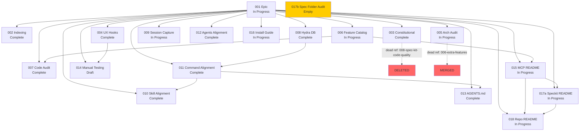

# Audit V3 — O9: Cross-Spec Dependency Graph

**Agent:** O9 — Cross-Spec Dependency Graph
**Date:** 2026-03-21
**Scope:** All 19 numbered spec phases (001-018 + duplicate 017) in `022-hybrid-rag-fusion`
**Method:** Read each spec.md, extract declared dependencies, statuses, predecessor/successor references, and scope overlaps

---

## 1. Spec Phase Inventory

The epic contains 19 numbered folders on disk (18 unique phase numbers, with `017` duplicated):

| # | Folder | Status (from spec.md) | Level |
|---|--------|-----------------------|-------|
| 001 | `001-hybrid-rag-fusion-epic` | In Progress (78.9%) | 3+ |
| 002 | `002-indexing-normalization` | Complete | 3 |
| 003 | `003-constitutional-learn-refactor` | Complete | 2 |
| 004 | `004-ux-hooks-automation` | Complete (Implemented) | 2 |
| 005 | `005-architecture-audit` | In Progress | 3 |
| 006 | `006-feature-catalog` | In Progress | 3 |
| 007 | `007-code-audit-per-feature-catalog` | Complete | 1 |
| 008 | `008-hydra-db-based-features` | Complete | 3 |
| 009 | `009-perfect-session-capturing` | In Progress | 3 |
| 010 | `010-skill-alignment` | Complete | 2 |
| 011 | `011-command-alignment` | Complete | 2 |
| 012 | `012-agents-alignment` | Complete | 2 |
| 013 | `013-agents-md-alignment` | Complete | 2 |
| 014 | `014-manual-testing-per-playbook` | Draft | 1 |
| 015 | `015-rewrite-memory-mcp-readme` | In Progress | 1 |
| 016 | `016-update-install-guide` | In Progress | 1 |
| 017a | `017-rewrite-system-speckit-readme` | In Progress | 1 |
| 017b | `017-spec-folder-alignment-audit` | Empty (no spec.md) | - |
| 018 | `018-rewrite-repo-readme` | In Progress | 1 |

**Non-numbered folders** (data artifacts, not spec phases):
- `feature_catalog/` — Feature catalog snapshot (19 categories)
- `manual_testing_playbook/` — Manual testing playbook (19 categories)
- `system-spec-kit/` — Symlink/mirror to the actual system-spec-kit skill

---

## 2. Dependency Graph

### 2.1 Declared Dependencies (Extracted from spec.md)

| Phase | Depends On | Depended On By |
|-------|-----------|----------------|
| 001 (epic) | None (root) | All phases (parent) |
| 002 (indexing-normalization) | None explicit | 004 (tier logic), 009 (indexing pipeline) |
| 003 (constitutional-learn) | `008-spec-kit-code-quality` (predecessor, deleted) | None explicit |
| 004 (ux-hooks) | None explicit (post-mutation hooks pattern) | 014 (manual testing NEW-103+) |
| 005 (architecture-audit) | `006-extra-features` (predecessor, merged) | None explicit |
| 006 (feature-catalog) | MCP server source code | 007 (code audit uses catalog), 011 (command alignment uses catalog), 015 (README grounding) |
| 007 (code-audit) | 006 (feature catalog as source of truth) | None explicit |
| 008 (hydra-db) | None explicit (absorbed 017-markovian) | 011 (shared memory tools), 013 (AGENTS.md shared commands) |
| 009 (session-capturing) | None explicit | None explicit |
| 010 (skill-alignment) | 011 (command-alignment, completed) | None explicit |
| 011 (command-alignment) | `tool-schemas.ts` (MCP tools = 32) | 010 (skill alignment references its completion), 013 (AGENTS.md references 7-command suite) |
| 012 (agents-alignment) | Canonical `.opencode/agent/` definitions | None explicit |
| 013 (agents-md-alignment) | 011 (7-command suite as source of truth) | None explicit |
| 014 (manual-testing) | Feature catalog, playbook | None explicit |
| 015 (MCP README) | 006 (feature catalog), 011 (command alignment) | 017a (links to MCP README), 018 (links to MCP README) |
| 016 (install guide) | `package.json` | None explicit |
| 017a (speckit README) | 015 (MCP README for cross-refs), 011 (command inventory) | 018 (links to speckit README) |
| 018 (repo README) | 015 (MCP README), 017a (speckit README) | None explicit |

### 2.2 Text-Based Dependency Graph (Mermaid Syntax)



### 2.3 ASCII Dependency Tree

```
001-hybrid-rag-fusion-epic (ROOT/PARENT)
 |
 +-- 002-indexing-normalization [Complete] (standalone foundation)
 |
 +-- 003-constitutional-learn-refactor [Complete] (dead predecessor ref)
 |
 +-- 004-ux-hooks-automation [Complete]
 |    |
 |    +---> 014-manual-testing (includes UX hook scenarios)
 |
 +-- 005-architecture-audit [In Progress] (dead predecessor ref)
 |
 +-- 006-feature-catalog [In Progress]
 |    |
 |    +---> 007-code-audit-per-feature-catalog
 |    +---> 015-rewrite-memory-mcp-readme (grounding)
 |
 +-- 007-code-audit-per-feature-catalog [Complete]
 |     depends on: 006
 |
 +-- 008-hydra-db-based-features [Complete]
 |    |
 |    +---> 011-command-alignment (shared memory tools)
 |
 +-- 009-perfect-session-capturing [In Progress] (large sub-tree: 000-019)
 |
 +-- 010-skill-alignment [Complete]
 |     depends on: 011 (reverse dependency!)
 |
 +-- 011-command-alignment [Complete]
 |    |
 |    +---> 010-skill-alignment
 |    +---> 013-agents-md-alignment
 |
 +-- 012-agents-alignment [Complete] (standalone sync)
 |
 +-- 013-agents-md-alignment [Complete]
 |     depends on: 011
 |
 +-- 014-manual-testing-per-playbook [Draft]
 |
 +-- 015-rewrite-memory-mcp-readme [In Progress]
 |    |     depends on: 006, 011
 |    +---> 017a-rewrite-system-speckit-readme
 |    +---> 018-rewrite-repo-readme
 |
 +-- 016-update-install-guide [In Progress] (standalone)
 |
 +-- 017a-rewrite-system-speckit-readme [In Progress]
 |    |     depends on: 015
 |    +---> 018-rewrite-repo-readme
 |
 +-- 017b-spec-folder-alignment-audit [EMPTY - no spec.md]
 |
 +-- 018-rewrite-repo-readme [In Progress]
       depends on: 015, 017a
```

---

## 3. Findings Summary by Severity

| Severity | Count | Description |
|----------|-------|-------------|
| CRITICAL | 2 | Duplicate phase number, epic dashboard missing 6 phases |
| HIGH | 4 | Broken predecessor refs, empty spec folder, status inconsistencies |
| MEDIUM | 4 | Scope overlaps, documentation chain fragility, dependency reversal |
| LOW | 3 | Orphan-like phases, stale parent phase numbers in metadata |

**Total findings: 13**

---

## 4. Circular Dependency Analysis

**No true circular dependencies found.** The dependency graph is acyclic (DAG).

One notable reverse-numbering dependency exists: phase 010 (skill-alignment) depends on 011 (command-alignment). This is not circular (010 does not feed back into 011), but it violates the implicit expectation that lower-numbered phases should be prerequisites of higher-numbered ones.

---

## 5. Individual Findings

### O9-001: Duplicate Phase Number 017

- **Severity**: CRITICAL
- **Category**: architecture
- **Location**: `022-hybrid-rag-fusion/017-rewrite-system-speckit-readme/` and `022-hybrid-rag-fusion/017-spec-folder-alignment-audit/`
- **Description**: Two distinct spec folders share phase number 017. `017-rewrite-system-speckit-readme` has a complete spec.md (Level 1, In Progress). `017-spec-folder-alignment-audit` contains only an empty `scratch/` directory with no spec.md, plan.md, or tasks.md.
- **Evidence**: `ls` of both folders confirms the collision. The epic dashboard in 001/spec.md does not list either `017` folder.
- **Impact**: Phase numbering collision breaks the 1:1 phase-to-number contract. References to "phase 017" are ambiguous. Recursive validation may skip or misidentify phases.
- **Recommended Fix**: Either delete the empty `017-spec-folder-alignment-audit` (if its work was absorbed elsewhere) or renumber one of the two folders. Since `017b` is empty, deletion is the safest option.

---

### O9-002: Epic Dashboard Missing Phases 014-018

- **Severity**: CRITICAL
- **Category**: alignment
- **Location**: `022-hybrid-rag-fusion/001-hybrid-rag-fusion-epic/spec.md` lines 77-97 (Child Folder Status Dashboard)
- **Description**: The dashboard table in the parent epic lists phases 001-013 but omits phases 014 (manual-testing), 015 (MCP README), 016 (install guide), 017 (speckit README), and 018 (repo README). It also incorrectly lists `010-skill-alignment` under folder number "009" alongside `009-perfect-session-capturing`.
- **Evidence**: Dashboard table ends at 013 (plus deleted folder entries). Phases 014-018 exist on disk and have active spec.md files.
- **Impact**: The parent epic does not reflect the actual phase tree. Anyone reading the dashboard would not know phases 014-018 exist. This violates the spec's own Phase Documentation Map convention.
- **Recommended Fix**: Add rows for 014-018 to the dashboard. Fix the "009" row for `010-skill-alignment` to show "010".

---

### O9-003: Broken Predecessor Reference in 003

- **Severity**: HIGH
- **Category**: dead-code
- **Location**: `022-hybrid-rag-fusion/003-constitutional-learn-refactor/spec.md` line 44
- **Description**: Phase 003 declares `Predecessor Phase: ../008-spec-kit-code-quality (Complete)`. This folder does not exist in the current epic structure. It appears to reference a pre-consolidation folder that was deleted.
- **Evidence**: No folder matching `008-spec-kit-code-quality` exists anywhere in the epic. The audit comment block in 001/spec.md does not mention this name in the folder mapping.
- **Impact**: The predecessor reference is a dead link. Anyone tracing the dependency chain from 003 backward lands on a non-existent folder.
- **Recommended Fix**: Update the predecessor reference to point to the correct current-state predecessor (likely `002-indexing-normalization` or remove the predecessor field if no upstream dependency exists).

---

### O9-004: Broken Predecessor Reference in 005

- **Severity**: HIGH
- **Category**: dead-code
- **Location**: `022-hybrid-rag-fusion/005-architecture-audit/spec.md` line 372
- **Description**: Phase 005 declares `Predecessor: 006-extra-features`. This folder was merged into `001-hybrid-rag-fusion-epic` during the 2026-03-16 consolidation (as Sprint 9 content).
- **Evidence**: Audit comment in 001/spec.md line 25 confirms: "006-extra-features (Sprint 9) -> merged into 001-hybrid-rag-fusion-epic sprint children (2026-03-16)".
- **Impact**: Dead predecessor reference. The semantic relationship is lost since the content was absorbed into the parent epic.
- **Recommended Fix**: Update the predecessor to reference `001-hybrid-rag-fusion-epic` (where the content now lives) or remove the stale reference.

---

### O9-005: Empty Spec Folder 017-spec-folder-alignment-audit

- **Severity**: HIGH
- **Category**: dead-code
- **Location**: `022-hybrid-rag-fusion/017-spec-folder-alignment-audit/`
- **Description**: This folder contains only an empty `scratch/` subdirectory. No spec.md, plan.md, tasks.md, or any other documentation file exists. The folder is not listed in the epic dashboard and appears to be an abandoned or accidentally created placeholder.
- **Evidence**: `ls -la` shows only a `scratch/` directory with no files. No spec.md exists.
- **Impact**: Occupies a phase number (017) that collides with `017-rewrite-system-speckit-readme`. Pollutes the spec tree with a non-functional folder.
- **Recommended Fix**: Delete the empty folder entirely, or if the work was intended, create proper spec documentation and assign a unique phase number (e.g., 019).

---

### O9-006: Status Inconsistency — 005 Dashboard vs Spec

- **Severity**: HIGH
- **Category**: alignment
- **Location**: Epic dashboard (001/spec.md line 83) vs 005/spec.md frontmatter
- **Description**: The epic dashboard lists `005-architecture-audit` as "Complete" (last updated 2026-03-08), but the spec.md of 005 itself declares `status: "in-progress"` (updated 2026-03-19). The spec includes a Phase 2 (Internal Module Boundary Audit) that is clearly active work.
- **Evidence**: Dashboard: "Complete | 2026-03-08". Spec.md frontmatter: `status: "in-progress"`, `updated: "2026-03-19"`, with Phase 15 status complete but Phase 2 ongoing.
- **Impact**: The epic understates the remaining work in 005. Downstream consumers relying on the dashboard would believe the architecture audit is finished.
- **Recommended Fix**: Update the epic dashboard to show `005-architecture-audit` as "In Progress" with the correct last-updated date.

---

### O9-007: Reverse-Numbered Dependency (010 depends on 011)

- **Severity**: MEDIUM
- **Category**: architecture
- **Location**: `022-hybrid-rag-fusion/010-skill-alignment/spec.md` line 144
- **Description**: Phase 010 (skill-alignment) explicitly declares a dependency on 011 (command-alignment): "Dependency: 011-command-alignment | Completed | Command documentation coverage is fully delivered (32/32 tools, 7 commands)". This means a lower-numbered phase depends on a higher-numbered phase, violating the implied sequential ordering.
- **Evidence**: spec.md line 144: "Dependency | `011-command-alignment` | Completed"
- **Impact**: Phase numbering does not reflect the actual execution order. 011 was completed before 010, despite having a higher number. This can confuse maintainers who expect sequential execution.
- **Recommended Fix**: No action required (numbering reflects creation order, not execution order), but document this explicitly in the epic. Future renumbering could resolve the confusion.

---

### O9-008: Documentation README Chain Fragility

- **Severity**: MEDIUM
- **Category**: architecture
- **Location**: Phases 015, 016, 017a, 018
- **Description**: The four README rewrite phases form a serial dependency chain: 015 (MCP README) -> 017a (Speckit README) -> 018 (Repo README), with 016 (Install Guide) standalone. Phase 018 references both 015 and 017a. Phase 017a references 015. If 015 is not completed first, the downstream phases will have inconsistent cross-references.
- **Evidence**: 017a/spec.md: "Dependency | MCP README rewrite (D1) | Medium". 018/spec.md: "Dependency | MCP README (D1) and Spec Kit README (D3) | Medium".
- **Impact**: All four are "In Progress" simultaneously. If they proceed in parallel (which the specs allow), cross-reference consistency is at risk.
- **Recommended Fix**: Explicitly document the serial ordering constraint in the epic dashboard: 015 -> 017a -> 018 (with 016 as a parallel standalone).

---

### O9-009: Scope Overlap — 006 and 007

- **Severity**: MEDIUM
- **Category**: architecture
- **Location**: `006-feature-catalog/spec.md` and `007-code-audit-per-feature-catalog/spec.md`
- **Description**: Phase 006 is the "Feature Catalog Comprehensive Audit & Remediation" (auditing and remediating the feature catalog). Phase 007 is the "Code Audit Per Feature Catalog" (auditing code against the feature catalog, with 21 child phases). Phase 006 absorbed `016-feature-catalog-code-references` which was specifically about code-to-catalog traceability -- the same concern as 007. The merged section in 006/spec.md explicitly describes adding `// Feature catalog: <name>` comments to code -- which is code audit work.
- **Evidence**: 006/spec.md line 251: "Merged Section: 016-feature-catalog-code-references" which "documents the code-to-catalog traceability work". 007/spec.md line 38: "The umbrella folder had no parent spec.md".
- **Impact**: Code-to-catalog traceability is claimed by both 006 (via merged 016) and 007 (as its entire purpose). Maintainers may not know which spec owns this concern.
- **Recommended Fix**: Clarify the boundary: 006 owns catalog content accuracy; the merged 016 section in 006 owns inline code comments; 007 owns the structural audit of code behavior against catalog categories. Document this boundary explicitly.

---

### O9-010: Scope Overlap — 009 Sub-Phases vs Epic Sprint Phases

- **Severity**: MEDIUM
- **Category**: architecture
- **Location**: `009-perfect-session-capturing/` (19 sub-phases) and `001-hybrid-rag-fusion-epic/` (8 sprint phases)
- **Description**: Phase 009 has grown into a massive sub-tree with 19 direct child phases (000-018, plus 019 as architecture remediation). Some of its child phases (like quality scoring, contamination detection, signal extraction) overlap conceptually with sprint phases in the epic (like Sprint 2 scoring calibration, Sprint 4 feedback and quality). The 009 spec itself acknowledges it has become a "parent pack" with its own lifecycle.
- **Evidence**: 009/spec.md describes phases 001-018 covering quality scoring, contamination, data fidelity, embedding optimization, JSON mode enrichment, etc. Meanwhile, 001/spec.md sprint phases cover scoring, quality, pipeline refactoring. Both touch the same MCP server codebase areas.
- **Impact**: A developer working on scoring or quality improvements must check both the epic sprint specs and the 009 sub-tree to understand the full picture. This creates navigational complexity and potential conflicting requirements.
- **Recommended Fix**: Add a scope boundary statement to both 001/spec.md and 009/spec.md clarifying that sprints focus on retrieval/search pipeline improvements while 009 focuses on memory save/capture quality. This distinction is implicit but never stated.

---

### O9-011: Epic Dashboard Row Error — 010 Listed as 009

- **Severity**: LOW
- **Category**: alignment
- **Location**: `001-hybrid-rag-fusion-epic/spec.md` line 88
- **Description**: The epic dashboard lists `010-skill-alignment` under folder number "009", duplicating the row number with `009-perfect-session-capturing`.
- **Evidence**: Line 88: "| 009 | `009-skill-alignment` | Complete | 2026-03-16 |" — but the actual folder is `010-skill-alignment`.
- **Impact**: Minor confusion in the dashboard. The phase number "009" appears twice (one for perfect-session-capturing, one for skill-alignment).
- **Recommended Fix**: Change the row to show "010" as the folder number.

---

### O9-012: Stale Parent Phase Numbers in Metadata

- **Severity**: LOW
- **Category**: alignment
- **Location**: Multiple specs (011, 015, 016, 017a, 018)
- **Description**: Several specs reference their "Parent" position using old pre-renumbering phase numbers. For example:
  - 011/spec.md: "Parent | 022-hybrid-rag-fusion (Phase 016)" — should be Phase 011
  - 015/spec.md: "Parent | 022-hybrid-rag-fusion (Phase 020)" — should be Phase 015
  - 016/spec.md: "Parent | 022-hybrid-rag-fusion (Phase 020)" — should be Phase 016
  - 017a/spec.md: "Parent | 022-hybrid-rag-fusion (Phase 021)" — should be Phase 017
  - 018/spec.md: "Parent | 022-hybrid-rag-fusion (Phase 022)" — should be Phase 018
- **Evidence**: The 2026-03-14 renumbering audit comment in 001/spec.md line 30 confirms the renumbering happened but these specs retained their old phase numbers in metadata.
- **Impact**: Metadata references stale phase numbers that no longer match folder names. Minor confusion.
- **Recommended Fix**: Update the `Parent` metadata in each spec to use the current folder-based phase number.

---

### O9-013: 014 Manual Testing References Phases But Is Draft

- **Severity**: LOW
- **Category**: alignment
- **Location**: `014-manual-testing-per-playbook/spec.md`
- **Description**: Phase 014 is still in "Draft" status (per its spec.md) and its 19 child phases are all "Draft". Yet phase 004 (ux-hooks-automation) spec.md line 114 declares: "Manual test playbook covers UX hook additions | manual test playbook document in folder 014-manual-testing-per-playbook includes NEW-103+ scenarios". This implies 014 should at least partially exist to validate 004's completion.
- **Evidence**: 004/spec.md REQ-007: "Manual test playbook covers UX hook additions". 014/spec.md status: "Draft".
- **Impact**: Phase 004 claims completion but its P1 verification artifact (manual testing in 014) is still draft. The completion claim may be premature for this specific requirement.
- **Recommended Fix**: Either downgrade 004's claim about manual test playbook coverage or upgrade the relevant 014 sub-phase (018-ux-hooks) from Draft to at least In Progress.

---

## 6. Bottleneck Analysis

**Phases with highest downstream dependency counts:**

| Phase | Downstream Dependents | Risk Level |
|-------|----------------------|------------|
| 001 (epic) | All 18 phases (parent) | Expected — this is the root |
| 006 (feature catalog) | 007, 015, (014 indirectly) | HIGH — if catalog is inaccurate, 3+ specs are affected |
| 011 (command alignment) | 010, 013, 015, 017a | HIGH — 7-command suite is referenced by 4 specs |
| 015 (MCP README) | 017a, 018 | MEDIUM — serial chain blocker |

**006 and 011 are the true bottleneck phases.** Both are complete, so the risk is retroactive (if they regress, many downstream specs break).

---

## 7. Phase Ordering vs Actual Dependency Graph

The parent epic's phase numbering (001-018) does **not** reflect the actual dependency graph. Key mismatches:

1. **010 depends on 011** (lower number depends on higher — reverse ordering)
2. **013 depends on 011** (correct ordering)
3. **015 -> 017a -> 018** is a serial chain but numbered non-consecutively (015, 017, 018 with 016 as standalone)
4. **006 -> 007** is correctly ordered
5. **Phases 002, 003, 004, 005, 008, 009, 012, 016** are effectively independent of each other

The numbering reflects creation/planning order, not execution order. This is acceptable but should be documented in the epic.

---

## 8. Missing Prerequisites Analysis

| Phase | Should Have Been Done Before | Rationale |
|-------|------------------------------|-----------|
| 007 (code audit) | 006 (feature catalog) | Code audit references catalog — 006 must be accurate first. Currently both are Complete/In Progress, which is correct. |
| 014 (manual testing) | All implementation phases (002-009) | Testing should follow implementation. Currently 014 is Draft while its subjects are Complete. Ordering is fine. |
| 015-018 (README rewrites) | All implementation phases | READMEs should document the final state. Currently all are In Progress while implementation phases are Complete. Correct ordering. |

No critical missing prerequisites found. The actual execution order appears reasonable despite the numbering confusion.

---

## 9. Broken Dependency Chains

| Chain | Issue |
|-------|-------|
| 003 -> `008-spec-kit-code-quality` | **BROKEN**: Predecessor folder deleted |
| 005 -> `006-extra-features` | **BROKEN**: Predecessor folder merged into 001 |
| 006 (In Progress) -> 007 (Complete) | **INVERTED**: 007 claims Complete but depends on 006 which is still In Progress |

The 006 -> 007 inversion is notable: phase 007 claims "Complete" status, but its upstream dependency 006 is still "In Progress". Since 007 is a structural umbrella (its 21 child phases are all Complete), the discrepancy is about the parent catalog accuracy rather than the child audit work. Still, 007's completion claim is premature while its source of truth (006) is still being updated.

---

## 10. Summary

### Key Takeaways

1. **No circular dependencies exist** — the graph is a clean DAG
2. **Two CRITICAL issues**: duplicate 017 number and incomplete epic dashboard
3. **Two broken predecessor references** point to deleted/merged folders
4. **One empty spec folder** (017b) should be cleaned up
5. **One status inconsistency** (005 dashboard says Complete, spec says In Progress)
6. **Phase numbering does not reflect execution order** but this is acceptable if documented
7. **The README chain (015 -> 017a -> 018)** is a serial bottleneck that should be explicitly ordered
8. **Phases 006 and 011** are structural bottlenecks with 3-4 downstream dependents each

### Recommended Priority Actions

1. **P0**: Delete empty `017-spec-folder-alignment-audit` to resolve the duplicate 017 collision
2. **P0**: Add phases 014-018 to the epic dashboard in 001/spec.md
3. **P0**: Fix the "009" -> "010" row error in the epic dashboard
4. **P1**: Fix broken predecessor references in 003 and 005
5. **P1**: Update epic dashboard status for 005 from "Complete" to "In Progress"
6. **P1**: Update stale parent phase numbers in metadata for 011, 015, 016, 017a, 018
7. **P2**: Add scope boundary clarification between 006/007 and between 009/001 sprints
8. **P2**: Document the README serial dependency chain explicitly
