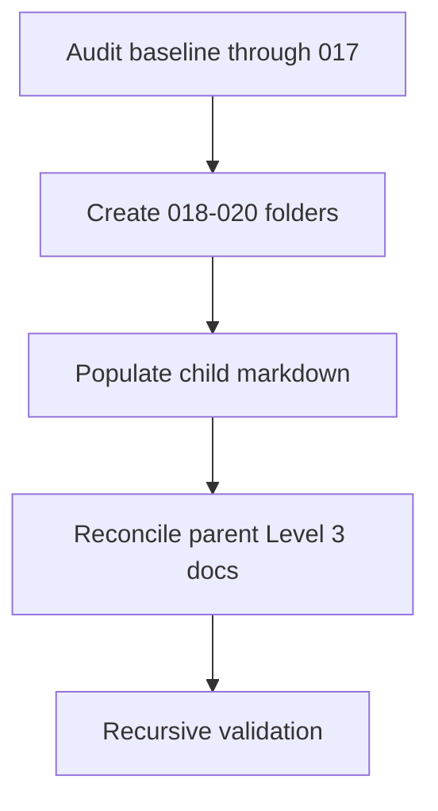

# Implementation Plan: Perfect Session Capturing

This document records the current verified state for this scope. Use [spec.md](spec.md) and [tasks.md](tasks.md) to trace the shipped runtime follow-through for phases `018` and `019` plus the open proof work in phase `020`.

<!-- SPECKIT_LEVEL: 3 -->
<!-- SPECKIT_TEMPLATE_SOURCE: plan-core | v2.2 -->

---

<!-- ANCHOR:summary -->
## 1. SUMMARY

### Technical Context

| Aspect | Value |
|--------|-------|
| **Language/Stack** | TypeScript, Markdown, shell validation commands |
| **Framework** | system-spec-kit Level 3 parent/child spec workflow |
| **Storage** | Parent and child phase folders under `.opencode/specs/.../010-perfect-session-capturing` |
| **Testing** | Focused Vitest, `npm run build`, `validate.sh --strict --recursive`, and `check-completion.sh --strict` |

### Overview

This pass implements the runtime and operator-contract follow-through for phases `018` and `019`, then keeps phase `020` explicitly open for retained live proof. The parent pack now reads cleanly from `001` through `020` while preserving the existing audit truth through `017` and keeping universal parity claims conservative.
<!-- /ANCHOR:summary -->

---

<!-- ANCHOR:quality-gates -->
## 2. QUALITY GATES

### Definition of Ready
- [x] Parent spec folder confirmed and in scope.
- [x] Existing audit baseline through phase `017` already present.
- [x] Scope narrowed to the roadmap runtime, test, and documentation surfaces for phases `018` through `020`.

### Definition of Done
- [x] Child phases `018`, `019`, and `020` exist.
- [x] Each new child phase has populated markdown rather than placeholder text.
- [x] The six parent Level 3 markdown files reference the roadmap phases consistently.
- [x] Pre-Task Checklist documented for the documentation pass.
- [x] Execution Rules documented for the documentation pass.
- [x] Status Reporting Format documented for the documentation pass.
- [x] Blocked Task Protocol documented for the documentation pass.
- [x] Recursive strict validation passes for the full parent pack.
- [x] Strict completion is rerun if needed after validation.

### Pre-Task Checklist
- [x] Parent pack and child phases read before editing.
- [x] Scope narrowed to spec-folder markdown only.
- [x] Existing audit truth through phase `017` preserved before extending the roadmap.

### Execution Rules

| Rule | Requirement |
|------|-------------|
| Scope Lock | Only edit the session-capturing runtime, focused tests, operator docs, and parent/child roadmap docs needed for phases `018`, `019`, and `020` |
| Truth Discipline | Keep phases `018` and `019` aligned to shipped runtime work while leaving phase `020` explicitly open for retained live proof |
| Parent Consistency | Keep all six parent Level 3 docs aligned to the same roadmap story |
| Verification | Finish with recursive strict validation of the full parent pack |

### Status Reporting Format

`Phase <id>: <status> -> <artifact or validation result>`

### Blocked Task Protocol
1. Stop if validation reports contradictory parent or child status.
2. Correct the smallest markdown surface needed to restore alignment.
3. Re-run validation before claiming completion.
<!-- /ANCHOR:quality-gates -->

---

<!-- ANCHOR:architecture -->
## 3. ARCHITECTURE

### Pattern
Parent roadmap reconciliation with explicit child-phase scaffolding.

### Key Components
- **Parent pack**: the six Level 3 root markdown files
- **Existing audit artifacts**: `research.md` and reconciled earlier phases
- **New child roadmap phases**:
  - `018-runtime-contract-and-indexability/`
  - `019-source-capabilities-and-structured-preference/`
  - `020-live-proof-and-parity-hardening/`
- **Verification stack**: recursive strict validation for the full spec tree

### Data Flow
Existing audit baseline -> child phase creation -> child markdown population -> parent doc reconciliation -> recursive validation -> final summary.
<!-- /ANCHOR:architecture -->

---

<!-- ANCHOR:phases -->
## 4. IMPLEMENTATION PHASES

### Phase 1: Setup
- [x] Create the three new child phase folders under the parent pack.
- [x] Ensure each new child phase has the expected markdown structure.

### Phase 2: Core Implementation
- [x] Replace scaffold placeholder content in phases `018`, `019`, and `020`.
- [x] Implement the runtime contract and source-capability follow-through for phases `018` and `019`.
- [x] Keep phase `020` documented as open retained live-proof work.
- [x] Extend the parent phase map and status language through `020`.
- [x] Rewrite parent plan, tasks, checklist, decision record, and summary to the shipped/open truth.

### Phase 3: Verification
- [x] Run recursive strict validation on the parent pack.
- [x] Run `check-completion.sh --strict` if validation passes and completion evidence is needed.
- [x] Fix any remaining validator findings without expanding scope.
<!-- /ANCHOR:phases -->

---

<!-- ANCHOR:testing -->
## 5. TESTING STRATEGY

| Test Type | Scope | Tools |
|-----------|-------|-------|
| Structural validation | Parent pack and all child phases | `validate.sh --strict --recursive` |
| Completion gating | Parent pack after validation | `check-completion.sh --strict` |
| Placeholder sweep | Parent docs and new child phase docs | `rg "\\[PLACEHOLDER\\]"` |
<!-- /ANCHOR:testing -->

---

<!-- ANCHOR:dependencies -->
## 6. DEPENDENCIES

| Dependency | Type | Status | Impact if Blocked |
|------------|------|--------|-------------------|
| Existing parent pack through phase `017` | Internal | Green | The roadmap extension would lose its baseline |
| Phase scaffolding script output | Internal | Green | Child folders would need manual reconstruction |
| Recursive validator | Internal | Pending rerun | Completion cannot be claimed until it passes |
<!-- /ANCHOR:dependencies -->

---

<!-- ANCHOR:rollback -->
## 7. ROLLBACK PLAN

- **Trigger**: Parent or child docs imply roadmap completion that has not happened, or validation fails after reconciliation.
- **Procedure**: Revert only the affected markdown files, restore the prior conservative state, and rerun recursive validation.
<!-- /ANCHOR:rollback -->

---

<!-- ANCHOR:phase-deps -->
## L2: PHASE DEPENDENCIES

```
Create Child Phases -> Populate Child Docs -> Reconcile Parent Docs -> Validate Recursively
```

| Phase | Depends On | Blocks |
|-------|------------|--------|
| Create child phases | None | All later work |
| Populate child docs | Child phases created | Parent reconciliation, validation |
| Reconcile parent docs | Child docs populated | Validation |
| Validate recursively | Parent and child docs reconciled | Completion |
<!-- /ANCHOR:phase-deps -->

---

<!-- ANCHOR:effort -->
## L2: EFFORT ESTIMATION

| Phase | Complexity | Estimated Effort |
|-------|------------|------------------|
| Child folder creation | Low | <1 hour |
| Child doc population | Medium | 1-2 hours |
| Parent reconciliation | Medium | 1-2 hours |
| Validation | Low | <1 hour |
| **Total** | | **3-5 hours** |
<!-- /ANCHOR:effort -->

---

<!-- ANCHOR:enhanced-rollback -->
## L2: ENHANCED ROLLBACK

### Pre-deployment Checklist
- [x] Existing parent docs re-read before editing.
- [x] Child phases created before parent references were finalized.
- [ ] Recursive validation rerun after the final markdown state settles.

### Rollback Procedure
1. Revert only the affected parent or child markdown files.
2. Restore conservative status language for phases `018` through `020`.
3. Re-run recursive validation.

### Data Reversal
- **Has data migrations?** No
- **Reversal procedure**: Markdown-only rollback within the spec tree
<!-- /ANCHOR:enhanced-rollback -->

---

<!-- ANCHOR:dependency-graph -->
## L3: DEPENDENCY GRAPH


<!-- /ANCHOR:dependency-graph -->
