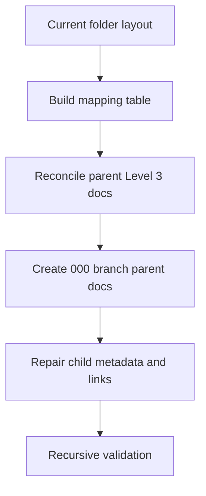

# Implementation Plan: Perfect Session Capturing

This document records the current verified state for this scope. Use [spec.md](spec.md) and [tasks.md](tasks.md) to trace the shipped runtime follow-through for phases `018` and `019`.

<!-- SPECKIT_LEVEL: 3 -->
<!-- SPECKIT_TEMPLATE_SOURCE: plan-core | v2.2 -->

---

<!-- ANCHOR:summary -->
## 1. SUMMARY

### Technical Context

| Aspect | Value |
|--------|-------|
| **Language/Stack** | TypeScript, Markdown, shell validation commands |
| **Framework** | system-spec-kit Level 3 parent/child spec workflow |
| **Storage** | Parent and child phase folders under `.opencode/specs/.../009-perfect-session-capturing` |
| **Testing** | Focused Vitest, `npm run build`, `validate.sh --strict --recursive`, and `check-completion.sh --strict` |

### Overview

This pass repairs stale current-navigation references across the authoritative docs. The parent pack now points at the actual direct-child folders, the archived dynamic-capture branch gets a proper parent spec pack, and active child metadata/links stop claiming folders that no longer exist.
<!-- /ANCHOR:summary -->

---

<!-- ANCHOR:quality-gates -->
## 2. QUALITY GATES

### Definition of Ready
- [x] Parent spec folder confirmed and in scope.
- [x] Existing audit baseline and current child-folder layout already present.
- [x] Scope narrowed to authoritative docs plus reusable research guidance.

### Definition of Done
- [x] `000-dynamic-capture-deprecation/` has a valid parent spec pack.
- [x] Current child phases and branch children expose valid identity and navigation metadata.
- [x] The six parent Level 3 markdown files reference the current phase tree consistently.
- [x] Pre-Task Checklist documented for the documentation pass.
- [x] Execution Rules documented for the documentation pass.
- [x] Status Reporting Format documented for the documentation pass.
- [x] Blocked Task Protocol documented for the documentation pass.
- [x] Recursive strict validation passes for the full parent pack.
- [x] Strict completion is rerun if needed after validation.

### Pre-Task Checklist
- [x] Parent pack and child phases read before editing.
- [x] Scope narrowed to spec-folder markdown only.
- [x] Existing audit truth preserved before rewriting navigation fields.

### Execution Rules

| Rule | Requirement |
|------|-------------|
| Scope Lock | Only edit authoritative spec docs and reusable research guidance needed to repair current-navigation references |
| Truth Discipline | Use the on-disk folder layout as canonical current truth while preserving historical narrative text where it is clearly historical |
| Parent Consistency | Keep all six parent Level 3 docs aligned to the same current phase-tree story |
| Verification | Finish with recursive strict validation of the full parent pack |

### Status Reporting Format

`Phase <id>: <status> -> <artifact or validation result>`

### Blocked Task Protocol
1. Stop if validation reports contradictory parent or child status.
2. Correct the smallest markdown surface needed to restore alignment.
3. Re-run validation before claiming completion.
<!-- /ANCHOR:quality-gates -->

---

<!-- ANCHOR:architecture -->
## 3. ARCHITECTURE

### Pattern
Parent/child phase-tree reconciliation with explicit branch-parent documentation.

### Key Components
- **Parent pack**: the six Level 3 root markdown files
- **Existing audit artifacts**: `research/research.md` and reconciled earlier phases
- **Archived branch parent**: `000-dynamic-capture-deprecation/`
- **Current direct-child continuation**:
  - `011-template-compliance/`
  - `012-auto-detection-fixes/`
  - `013-spec-descriptions/`
  - `014-stateless-quality-gates/`
  - `015-runtime-contract-and-indexability/`
  - `016-json-mode-hybrid-enrichment/`
  - `017-json-primary-deprecation/`
  - `018-memory-save-quality-fixes/`
- **Verification stack**: recursive strict validation for the full spec tree

### Data Flow
Mapping table -> root doc reconciliation -> branch-parent creation -> child metadata/link repair -> recursive validation -> stale-reference sweep.
<!-- /ANCHOR:architecture -->

---

<!-- ANCHOR:phases -->
## 4. IMPLEMENTATION PHASES

### Phase 1: Setup
- [x] Build the old-to-new mapping table from the current folder layout.
- [x] Confirm the in-scope authoring set excludes `memory/**` and `scratch/**`.

### Phase 2: Core Implementation
- [x] Rewrite the root Level 3 docs to the actual direct-child phase tree.
- [x] Create the missing `000-dynamic-capture-deprecation/{spec,plan,tasks}.md` parent pack.
- [x] Repair active child `Spec Folder`, `Branch`, predecessor/successor, and parent references.
- [x] Repair moved branch-child identity fields and current-navigation references.
- [x] Update reusable research guidance only if it presents stale current-navigation paths.

### Phase 3: Verification
- [x] Run recursive strict validation on the parent pack.
- [x] Run `check-completion.sh --strict` if validation passes and completion evidence is needed.
- [x] Fix any remaining validator findings without expanding scope.
<!-- /ANCHOR:phases -->

---

<!-- ANCHOR:testing -->
## 5. TESTING STRATEGY

| Test Type | Scope | Tools |
|-----------|-------|-------|
| Structural validation | Parent pack and all child phases | `validate.sh --strict --recursive` |
| Stale-reference sweep | In-scope docs only | `rg` for moved/removed phase paths |
| Placeholder sweep | Parent docs and touched child phase docs | `rg "\\[PLACEHOLDER\\]"` |
<!-- /ANCHOR:testing -->

---

<!-- ANCHOR:dependencies -->
## 6. DEPENDENCIES

| Dependency | Type | Status | Impact if Blocked |
|------------|------|--------|-------------------|
| Existing parent pack and child layout | Internal | Green | The repair would lose its source of truth |
| Branch child docs under `000-dynamic-capture-deprecation/` | Internal | Green | The moved branch could not be reattached cleanly |
| Recursive validator | Internal | Pending rerun | Completion cannot be claimed until it passes |
<!-- /ANCHOR:dependencies -->

---

<!-- ANCHOR:rollback -->
## 7. ROLLBACK PLAN

- **Trigger**: Any repaired doc points at a non-existent current path, or recursive validation still reports integrity/link failures.
- **Procedure**: Revert only the affected markdown files, restore the last known-valid navigation state, and rerun recursive validation.
<!-- /ANCHOR:rollback -->

---

<!-- ANCHOR:phase-deps -->
<!-- ANCHOR:dependencies -->
## L2: PHASE DEPENDENCIES

```
Build Mapping -> Reconcile Parent Docs -> Create Branch Parent Docs -> Repair Child Links -> Validate Recursively
```

| Phase | Depends On | Blocks |
|-------|------------|--------|
| Build mapping | None | All later work |
| Reconcile parent docs | Mapping complete | Branch parent creation, child repair, validation |
| Create branch parent docs | Parent docs reconciled | Child repair, validation |
| Repair child links | Parent and branch-parent docs ready | Validation |
| Validate recursively | Parent and child docs reconciled | Completion |
<!-- /ANCHOR:phase-deps -->

---

<!-- ANCHOR:effort -->
<!-- /ANCHOR:dependencies -->
## L2: EFFORT ESTIMATION

| Phase | Complexity | Estimated Effort |
|-------|------------|------------------|
| Mapping and scope audit | Low | <1 hour |
| Parent reconciliation | Medium | 1-2 hours |
| Branch parent creation | Low | <1 hour |
| Child metadata/link repair | Medium | 1-2 hours |
| Validation | Low | <1 hour |
| **Total** | | **3-5 hours** |
<!-- /ANCHOR:effort -->

---

<!-- ANCHOR:enhanced-rollback -->
## L2: ENHANCED ROLLBACK

### Pre-deployment Checklist
- [x] Existing parent docs re-read before editing.
- [x] Child phases created before parent references were finalized.
- [x] Recursive validation rerun after the final markdown state settles.

### Rollback Procedure
1. Revert only the affected parent or child markdown files.
2. Restore conservative status language for phases `018` and `019`.
3. Re-run recursive validation.

### Data Reversal
- **Has data migrations?** No
- **Reversal procedure**: Markdown-only rollback within the spec tree
<!-- /ANCHOR:enhanced-rollback -->

---

<!-- ANCHOR:dependency-graph -->
## L3: DEPENDENCY GRAPH


<!-- /ANCHOR:dependency-graph -->
