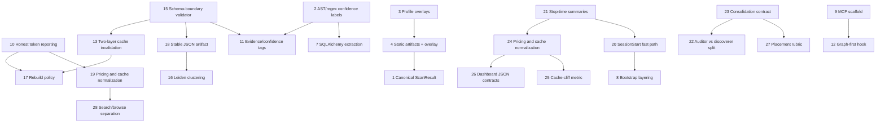

# Master Consolidation — External Systems Research (Phase 2)

> Second-pass deep-research synthesis of 5 first-pass packets. 8 iterations, composite 0.94, all 6 cross-phase questions answered. Built upon iter-2 to iter-7 outputs in `research/iterations/`.
> Charter: `scratch/deep-research-prompt-master-consolidation.md`
> **Archive Note:** This v1 snapshot predates folder normalization (April 2026). References to `phase-N/...` map to current child-folder paths under `001-research-graph-context-systems/`.

## 1. Executive summary
- Adopt one publication rule for token savings now: no Public headline percentage or multiplier should ship until the same frozen task corpus has provider-counted token totals and reproducible answer-quality scores. [SOURCE: research/iterations/q-a-token-honesty.md:115-125]
- Treat the next implementation wave as a topology-preserving hardening pass, not a substrate swap: Public already leads structural and semantic query, so the best work improves routing, continuity, and observability around those surfaces. [SOURCE: research/cross-phase-matrix.md:40-56] [SOURCE: research/iterations/q-c-composition-risk.md:11-16]
- Front-load P0 rails before feature scale: benchmark-honest reporting, deterministic Stop-time summaries, schema-boundary validation, AST-vs-regex honesty, and the four-phase memory-consolidation contract all unlock later work with low composition risk. [SOURCE: research/iterations/q-d-adoption-sequencing.md:15-27]
- Prioritize Claudest-derived continuity patterns over monolithic orchestration ideas: cached summaries, Stop-time producers, cache-cliff metrics, and browse/search clarity fit Spec Kit Memory directly and avoid cross-surface ownership drift. [SOURCE: research/iterations/q-c-composition-risk.md:40-49] [SOURCE: research/iterations/q-f-killer-combos.md:11-29]
- Reuse Graphify where it sharpens behavior at the boundary, not where it centralizes control: the graph-first hook, validator, and evidence-tagging vocabulary are high-leverage; the rebuild coordinator and cross-surface orchestration layers are not. [SOURCE: research/iterations/q-c-composition-risk.md:33-39] [SOURCE: research/iterations/q-d-adoption-sequencing.md:33-41]
- Treat CodeSight as a packaging and detector-discipline reference, not as a verified token-savings benchmark: its strongest transferable pieces are profile overlays, fixture-based detector regression, AST/regex provenance honesty, and honest naming of centrality heuristics. [SOURCE: research/iterations/q-a-token-honesty.md:42-53] [SOURCE: research/iterations/q-c-composition-risk.md:22-28]
- Keep Contextador in the concept-transfer lane only. Its best surviving ideas are setup ergonomics and reporting discipline; AGPL plus Bun make direct source reuse a bad fit for this stack. [SOURCE: research/iterations/q-e-license-runtime.md:35-39] [SOURCE: research/iterations/q-c-composition-risk.md:29-31]
- Package the first release around measurable outcomes: lower session-start cost, fewer first-query detours, explicit provenance in structural answers, and dashboard rows backed by the frozen-task methodology rather than blended headline estimates. [SOURCE: research/iterations/q-f-killer-combos.md:21-22] [SOURCE: research/iterations/q-d-adoption-sequencing.md:108-116]

## 2. The 5 systems in one paragraph each
### 001 Claude Optimization Settings
Phase 001 stays valuable as an operating-evidence packet rather than as a code adoption target. Its strongest confirmed contribution is that deferred tool loading is already a baseline win for Public, because it reduces upfront schema payload and supports the existing `ENABLE_TOOL_SEARCH` direction. Its biggest weakness is measurement discipline: first-tool latency, discoverability ergonomics, remedy-bundle net cost, and edit-retry root-cause bucketing all remained partially closed or UNKNOWN after the second pass. Public should therefore keep the configuration lesson while refusing to inherit the Reddit extrapolations as its own benchmark language. [SOURCE: phase-1/research/research.md:36-61] [SOURCE: phase-1/research/research.md:179-191] [SOURCE: research/iterations/iteration-2.md:18-56]

### 002 CodeSight
CodeSight emerged as the cleanest Node-native packaging reference in the set. Its key strength is disciplined structure packaging: one canonical scan result, per-tool projection overlays, fixture-backed detector evaluation, and a generally practical assistant-artifact generation story. Its weakest area is honesty around scope and certainty: the 11.2x claim is heuristic, Go is mislabeled as AST-backed, tRPC/Fastify enrichment is incomplete, and blast-radius quality is under-instrumented. Public should borrow CodeSight’s packaging discipline and regression harnesses, but not its benchmark language or monolithic upstream scan shape. [SOURCE: phase-2/research/research.md:142-150] [SOURCE: phase-2/research/research.md:243-255] [SOURCE: phase-2/research/research.md:272-306] [SOURCE: phase-2/research/research.md:338-341] [SOURCE: phase-2/research/research.md:668-681]

### 003 Contextador
Contextador’s current state is best understood as a retrieval-ergonomics system built around authored pointers, setup scaffolding, and optional collaboration via Mainframe. Its key strength is operator experience: root-scoped bootstrap, config-driven activation, text-first pointer delivery, and a concrete concept of benchmark honesty that survived into the final recommendations. Its key weakness is the pair of hard gates surfaced in the second pass: AGPL licensing and Bun runtime dependency, plus privacy and consistency weaknesses in the Matrix-backed Mainframe lane. Public should study Contextador for setup and measurement discipline, but reimplement cleanly inside existing runtimes and avoid any source-lift temptation. [SOURCE: phase-3/research/research.md:55-64] [SOURCE: phase-3/research/research.md:145-153] [SOURCE: phase-3/research/research.md:175-204] [SOURCE: research/iterations/iteration-3.md:31-57]

### 004 Graphify
Graphify remains the strongest extraction engine in the comparison set when the question is AST breadth, multimodal reach, and explicit evidence vocabulary. Its best strength is not the 71.5x claim; it is the combination of multi-language AST extraction, transport-level evidence labels, graph-aware exports, and a behavior-shaping PreToolUse hook that can steer agents toward better first queries. Its biggest weakness is uneven implementation maturity: Python is much richer than the other languages, Swift is detected but never extracted, multimodal artifact labeling is stale, and the headline ratio is still heuristic. Public should borrow Graphify’s evidence and guidance patterns, but keep the more ambitious orchestration and rebuild ideas behind a later proof gate. [SOURCE: phase-4/research/research.md:617-645] [SOURCE: phase-4/research/research.md:655-660] [SOURCE: phase-4/research/research.md:683-685] [SOURCE: research/iterations/iteration-3.md:59-99]

### 005 Claudest
Claudest finished as the most practically reusable system even though it was not the cleanest legal/runtime fit. Its key strength is continuity discipline: cached `context_summary` startup, deterministic Stop-time production, FTS capability detection, consolidation contracts, pricing/cache normalization, and explicit auditor-vs-discoverer roles all reinforce the owner that Public already calls Spec Kit Memory. Its biggest weakness is portability evidence rather than design quality: the snapshot lacks a canonical `LICENSE` file, the host model assumes Claude plugin lifecycles, and Public still lacks the producer-side fields needed to reproduce Claudest-grade analytics honestly. Public should still treat Claudest as the primary reference for the next implementation wave, because its best ideas compose inside one existing surface instead of pressuring the architecture toward a monolith. [SOURCE: phase-5/research/research.md:107-113] [SOURCE: phase-5/research/research.md:171-220] [SOURCE: phase-5/research/research.md:273-320] [SOURCE: phase-5/research/research.md:395-405] [SOURCE: research/iterations/iteration-3.md:101-134]

## 3. Token-honesty audit table (Q-A)
The table below is assembled from the iteration-5 audit and translated into the master packet’s publication rule framing. For the full per-system reasoning, falsification logic, and methodology discussion, see the source file directly. [SOURCE: research/iterations/q-a-token-honesty.md:16-25] [SOURCE: research/iterations/q-a-token-honesty.md:115-125]

| System | Claimed reduction | Measurement method | Evidence quality (high/med/low/none) | Falsification test | Recommended Public methodology |
|---|---|---|---|---|---|
| 001 Claude Optimization Settings | `~14,000` tokens/turn; rough `264M` extrapolation | Observed before/after field delta, then session arithmetic | med | Matched A/B runs on the same tasks with latency and follow-up cost included | Use only as upstream evidence for smaller upfront schema payload; do not publish it as a Public benchmark |
| 002 CodeSight | `11.2x` | Fixed exploration constants plus chars/4 output estimate | low | Freeze tasks and compare real provider-counted prompts against CodeSight outputs | Borrow the packaging pattern, then re-measure with Public telemetry before claiming any multiplier |
| 003 Contextador | `93%` | Two hard-coded `25,000`-token constants compared against usage counters | low | Run paired tasks against Public’s split stack and require equal answer quality | Treat pointer compression as a pattern and keep savings numbers labeled estimated until benchmarked |
| 004 Graphify | `71.5x` | Chars/token heuristic plus estimated corpus words and BFS subgraphs | low | Compare full-corpus vs graphified prompts with provider-counted totals on one frozen corpus | Use Graphify to motivate benchmark design, not to inherit its ratio |
| 005 Claudest | No headline ratio; cached summaries are the savings vector | Stop-time summary producer + SessionStart DB lookup + normalized analytics | med | Compare startup recall with and without cached summaries on the same sessions | Adopt cached summaries and analytics first, then publish measured startup deltas later |
| Public (baseline today) | No system-wide ratio; only local feature estimates | Envelope estimates, formatter approximations, retrieval telemetry, and eval controls | low | Require provider-counted prompt/completion/cache totals and reproducible pass-rate scoring | Publish per-turn, per-query, per-session-start, and per-batch tables separately; never blend them into one number |

The audit makes two things clear. First, no system in this set earns a high-confidence headline savings claim today. The closest is phase 001 because it starts from real observed token deltas, while the weakest are CodeSight, Contextador, and Graphify because their ratios depend on fixed constants or heuristics rather than provider-counted prompts. Claudest is stronger not because it publishes a bigger number, but because it invests in the producer/consumer and analytics mechanics that can support an honest number later. [SOURCE: research/iterations/q-a-token-honesty.md:6-14] [SOURCE: research/iterations/q-a-token-honesty.md:29-92]

Second, comparability only appears once units are separated. Per-turn schema savings, per-query pointer compression, per-corpus graph benchmarks, and per-session-start summary caching are different phenomena, so they should remain in different tables. Public’s recommended methodology therefore insists on frozen tasks, answer-quality gates, separate reporting units, and provider-counted totals before publication. [SOURCE: research/iterations/q-a-token-honesty.md:94-125]

## 4. Capability matrix (Q-B)
The matrix below is embedded unchanged in structure from iteration 4; the per-capability rationale remains in the source matrix so this master document can focus on implications rather than repeating every row’s justification. [SOURCE: research/cross-phase-matrix.md:6-18] [SOURCE: research/cross-phase-matrix.md:20-123]

| # | Capability | 001 Settings | 002 CodeSight | 003 Contextador | 004 Graphify | 005 Claudest | Public (baseline) | Dominant |
|---|---|---|---|---|---|---|---|---|
| 1 | Code AST coverage | - | 1 | 0 | 2 | 0 | 1 | 004 Graphify |
| 2 | Multimodal support | - | 0 | 0 | 2 | 1 | 1 | 004 Graphify |
| 3 | Structural query | - | 1 | 0 | 1 | 0 | 2 | Public |
| 4 | Semantic query | - | 0 | 0 | 1 | 0 | 2 | Public |
| 5 | Memory / continuity | - | 1 | 1 | 1 | 2 | 2 | Public (tie 005) |
| 6 | Observability | - | 1 | 1 | 1 | 2 | 2 | Public (tie 005) |
| 7 | Hook integration | - | 0 | 0 | 1 | 2 | 2 | Public (tie 005) |
| 8 | License compatibility | - | 2 | 0 | 2 | 2 | - | 002 CodeSight (tie 004/005) |
| 9 | Runtime portability | - | 2 | 0 | 1 | 1 | 1 | 002 CodeSight |

- Public dominates where it matters most to this packet: structural query and semantic query. [SOURCE: research/cross-phase-matrix.md:40-56]
- Graphify dominates AST breadth and multimodal extraction, making it the strongest source of bounded structural and evidence-layer ideas. [SOURCE: research/cross-phase-matrix.md:22-38]
- No capability row is a true market gap. The problem is adoption order and composition safety, not raw missing capability. [SOURCE: research/cross-phase-matrix.md:103-123]

## 5. Cross-phase findings
### 5.1 Q-A — Token-savings honesty
The token-honesty audit converged on a simple but important conclusion: none of the five external systems are currently publishing a cross-system-comparable number, and Public should not pretend otherwise. Phase 001 is the most grounded because it starts from real observed token deltas, but the session/turn denominators still drift and the ergonomics half of the claim was never benchmarked. CodeSight, Contextador, and Graphify all present confident savings language even though their numerators or denominators rely on fixed constants, heuristics, or synthetic corpus arithmetic rather than provider-counted prompts. Claudest is the outlier because it does not promise one giant ratio at all; it ships the producer/consumer mechanics and normalized analytics structure that would let a team earn a ratio later. [SOURCE: research/iterations/q-a-token-honesty.md:6-25] [SOURCE: research/iterations/q-a-token-honesty.md:94-114]

The practical implication for Public is that capability strength and measurement strength are not the same axis. Iteration 4 already showed that Public leads structural and semantic query while tying Claudest on observability breadth, so the honest question is narrower than "which repo claims the biggest savings". It is instead "how many tokens, how much latency, and how many follow-up hops does the same task require when the answer-quality bar is held constant". That is why the recommended methodology splits reporting by unit of work, freezes the repo snapshot and task corpus, and requires provider-counted totals before any headline publication. [SOURCE: research/iterations/q-a-token-honesty.md:104-125] [SOURCE: research/cross-phase-matrix.md:40-74]

The second-pass audit therefore changes the adoption tone for every system. Public can still use phase-1 field evidence to justify `ENABLE_TOOL_SEARCH`, can still borrow CodeSight’s packaging ideas, can still study Contextador’s pointer compression, can still admire Graphify’s extraction reach, and can still prioritize Claudest’s startup strategy. What it cannot honestly do is flatten those into one blended multiplier. The fixed-task publication rule should be treated as a gate on program language, not just a nice-to-have dashboard improvement. [SOURCE: research/iterations/q-a-token-honesty.md:115-141]


### 5.2 Q-B — Capability matrix
The capability matrix resolved a major uncertainty from the first-pass packets: Public is not missing a substrate. Across the nine scored capabilities, Public leads structural query and semantic query outright, ties Claudest on memory, observability, and hook integration, and only clearly trails Graphify on AST breadth and multimodal extraction. CodeSight leads only in the cleaner Node/runtime lane, while Contextador does not win a single capability row under the unified rubric. [SOURCE: research/cross-phase-matrix.md:6-18] [SOURCE: research/cross-phase-matrix.md:107-123]

That matters because it reframes what "adoption" should mean. The master packet is not searching for a replacement system to install wholesale; it is selecting bounded patterns that reinforce owners Public already has. The absence of any true-gap row confirms that the next program is about composition discipline, honest measurement, and better handoffs between existing owners, not about inventing an all-purpose context platform. [SOURCE: research/cross-phase-matrix.md:103-123] [SOURCE: research/iterations/iteration-4.md:22-31]


### 5.3 Q-C — Composition risk
Q-C is where the master consolidation most clearly departed from any one phase packet. Once Public’s split topology became the reference frame, the pattern across 28 candidates was obvious: low-risk wins stayed inside one owner surface or taught the model how to pick the right owner, while high-risk ideas tried to create a new control layer above semantic, structural, and memory retrieval. That is why the final distribution landed at 16 low-risk, 9 medium-risk, and only 3 high-risk candidates. [SOURCE: research/iterations/q-c-composition-risk.md:11-20] [SOURCE: research/iterations/iteration-6.md:20-29]

The safest fast wins cluster tightly. Claudest’s cached `context_summary` fast path, deterministic Stop-time summaries, cache-cliff metrics, dashboard contracts, and browse/search separation all fit within Spec Kit Memory. Graphify’s PreToolUse hook and validator help the model or the pipeline respect existing boundaries rather than replacing them. CodeSight’s F1 harness and profile overlays stay as packaging or regression tooling beside the three owner surfaces. In other words, the winning moves add leverage at the seam without moving ownership. [SOURCE: research/iterations/q-c-composition-risk.md:11-16] [SOURCE: research/iterations/q-c-composition-risk.md:77-131]

The high-risk count is small but decisive. CodeSight’s canonical `ScanResult`, Contextador’s bootstrap facade, and Graphify’s modality-aware rebuild coordinator each look elegant in isolation, yet each one asks Public to relocate routing or freshness authority into a shared orchestration plane. That is exactly the class of change iteration 6 rejected. The second pass did not say those ideas are bad in the abstract; it said they are bad fits for this specific stack until much later, if ever. [SOURCE: research/iterations/q-c-composition-risk.md:133-151] [SOURCE: research/iterations/iteration-6.md:31-42]


### 5.4 Q-D — Adoption sequencing
Q-D translated the composition findings into a topological rollout. The roadmap is intentionally front-loaded with rails: honest reporting, Stop-time producers, validation, provenance labeling, and workflow scaffolds. Those are not glamorous, but they are what make later memory, routing, and dashboard work truthful rather than aspirational. P0 and early P1 therefore focus on low-risk items that unlock multiple later nodes without forcing a topology review. [SOURCE: research/iterations/q-d-adoption-sequencing.md:6-11] [SOURCE: research/iterations/q-d-adoption-sequencing.md:108-116]

The later phases are equally instructive. P2 is where additive features such as cache-cliff metrics, dashboard contracts, browse/search separation, Leiden clustering, and the auditor/discoverer split become reasonable because their prerequisites already exist. P3 isolates the three monolith-leaning candidates so they cannot quietly ride along inside earlier implementation work. That separation is a policy choice as much as a technical one: it keeps the strongest fast wins from being blocked by speculative redesign work. [SOURCE: research/iterations/q-d-adoption-sequencing.md:44-61] [SOURCE: research/iterations/iteration-7.md:7-17]

```text
P0  measurement rails + summary producers + schema honesty
    -> benchmark-honest reporting
    -> deterministic Stop-time summaries
    -> validator + AST/regex confidence discipline
    -> consolidation contract + setup scaffold + regression harnesses

P1  bounded adapters on top of P0
    -> graph-first hook
    -> cached SessionStart summary fast path
    -> placement rubric + overlay packaging + FTS cascade
    -> evidence/confidence tagging + stable interchange + invalidation

P2  feature surfacing after rails exist
    -> CLAUDE.md companion guidance
    -> cache-cliff metric + dashboard JSON contracts
    -> search/browse separation + Leiden clustering
    -> auditor vs discoverer split

P3  speculative or redesign-pressure candidates only
    -> canonical ScanResult
    -> bootstrap layering
    -> modality-aware rebuild policy
```


### 5.5 Q-E — License + runtime
Q-E simplified several earlier ambiguities by applying one consistent rule: portability requires both technical fit and license evidence in the checked-in snapshot. Under that rule, none of the five systems qualified as fully source-portable in this checkout. CodeSight, Graphify, and Claudest all became `mixed` because their runtimes can fit or be adapted, but the snapshots still lack a canonical `LICENSE` file. Phase 001 remained concept-only because it is a field report, and Contextador remained concept-only because it is both AGPL and Bun-native. [SOURCE: research/iterations/q-e-license-runtime.md:5-21] [SOURCE: research/iterations/iteration-6.md:8-19]

The AGPL trap deserves a separate callout because it changes the safe borrowing boundary materially. Iteration 6 did not merely say "do not copy code". It extended the caution to tests, prompt templates that function like program logic, distinctive schema signatures, and API shapes that would effectively recreate the same implementation contract. That boundary is why Contextador still contributes to the final recommendations only through concept-transfer patterns such as benchmark honesty and setup ergonomics. [SOURCE: research/iterations/q-e-license-runtime.md:50-69]


### 5.6 Q-F — Killer combos
Q-F answered the last strategic question: where do multiple medium-sized ideas multiply rather than merely add? The top three combos all won for the same reason. Each compresses one handoff point and then hands control back to owners Public already has, instead of trying to define a new universal owner. That is why the best score went to the warm-start memory plus graph-first routing combo, while the monolithic scan/bootstrap cluster was explicitly rejected. [SOURCE: research/iterations/q-f-killer-combos.md:6-10] [SOURCE: research/iterations/q-f-killer-combos.md:71-80]


| Title | Components | Score | Effort |
|---|---|---|---|
| Warm-start memory + graph-first routing | Stop-time summaries + SessionStart fast path + Graph-first hook | 9/10 | M |
| Auditable savings before scale | Honest reporting + pricing/cache normalization + dashboard contracts | 8/10 | M |
| Trustworthy structural projections | AST/regex honesty + evidence tagging + static artifacts + live overlay | 8/10 | M |

## 6. Per-phase gap closure log
The table below is the master gap ledger for all 26 charter gaps. Status, tag, confidence, and first evidence pointer were assembled from the structured iter-2 and iter-3 closure JSON plus the narrative summaries in `iteration-2.md` and `iteration-3.md`. [SOURCE: research/iterations/iteration-2.md:3-15] [SOURCE: research/iterations/iteration-3.md:3-21] [SOURCE: research/iterations/gap-closure-phases-1-2.json:1-542] [SOURCE: research/iterations/gap-closure-phases-3-4-5.json:1-896]

| Gap ID | Status | Tag | Confidence | Evidence pointer (citation) |
|---|---|---|---|---|
| G1.Q2 | partial | phase-1-extended | medium | `phase-1/research/research.md:49-60` |
| G1.Q8 | UNKNOWN | phase-1-confirmed | low | `phase-1/research/research.md:559-560` |
| G1.Q9 | partial | phase-1-extended | medium | `phase-1/research/research.md:218-229` |
| G1.RM | partial | phase-1-extended | medium | `phase-1/decision-record.md:139-160` |
| G1.X1 | closed | new-cross-phase | low | `phase-1/research/research.md:179-196` |
| G2.T11 | closed | phase-1-extended | medium | `phase-2/research/research.md:338-341` |
| G2.TR | closed | phase-1-extended | medium | `phase-2/research/research.md:668-672` |
| G2.GO | closed | phase-1-corrected | medium | `phase-2/research/research.md:676-681` |
| G2.MR | partial | phase-1-extended | medium | `phase-2/research/research.md:691-696` |
| G2.BR | partial | phase-1-extended | medium | `phase-2/research/research.md:243-255` |
| G3.T93 | partial | phase-1-extended | high | `phase-3/research/research.md:145-153` |
| G3.MF | closed | phase-1-confirmed | high | `phase-3/research/research.md:135-143` |
| G3.MX | closed | phase-1-extended | high | `phase-3/research/research.md:138-143` |
| G3.GH | closed | phase-1-extended | high | `phase-3/research/research.md:215-223` |
| G3.RQ | closed | phase-1-extended | high | `phase-3/research/research.md:105-113` |
| G4.T715 | partial | phase-1-confirmed | high | `phase-4/research/research.md:68-68` |
| G4.CG | closed | phase-1-confirmed | high | `phase-4/research/research.md:127-131` |
| G4.LP | closed | phase-1-confirmed | high | `phase-4/research/research.md:621-623` |
| G4.IE | closed | phase-1-extended | high | `phase-4/research/research.md:128-128` |
| G4.MM | partial | phase-1-confirmed | high | `phase-4/research/research.md:683-685` |
| G4.PT | UNKNOWN | phase-1-confirmed | medium | `phase-4/research/research.md:76-76` |
| G5.FT | closed | phase-1-extended | medium | `phase-5/research/research.md:107-113` |
| G5.SH | closed | phase-1-confirmed | low | `phase-5/research/research.md:613-616` |
| G5.CMD | closed | phase-1-confirmed | medium | `phase-5/research/research.md:444-444` |
| G5.FB | closed | phase-1-confirmed | high | `phase-5/research/research.md:198-200` |
| G5.SE | closed | new-cross-phase | medium | `phase-5/research/research.md:219-235` |

The closure pattern is as important as the counts. Sixteen gaps closed, eight narrowed to partial, and only two remained UNKNOWN; both of the UNKNOWNs are measurement gaps, not code-shape mysteries. That means the second pass did what the charter intended: it converted broad uncertainty into a bounded evidence ledger, while refusing to invent certainty where the source material simply does not provide it. [SOURCE: research/deep-research-dashboard.md:15-19] [SOURCE: research/iterations/iteration-2.md:28-46] [SOURCE: research/iterations/iteration-3.md:94-99]

## 7. Composition risk analysis (Q-C)
This condensed table reproduces the top 15 rows from the candidate composition table and preserves the exact risk framing from iteration 6. The full 28-row candidate table remains the detailed reference. [SOURCE: research/iterations/q-c-composition-risk.md:18-49]

| # | Candidate | Phase | Q-E verdict | Surface(s) touched | Composition risk | Conflict notes |
|---|---|---|---|---|---|---|
| 1 | Single-canonical-ScanResult orchestration shape | 002 | mixed | CocoIndex + Code Graph + Spec Kit Memory | high | Assumes one upstream scan feeding multiple surfaces; clashes with explicit split routing. |
| 2 | AST-first / regex-fallback / confidence labels | 002 | mixed | Code Graph | low | Single-surface structural improvement; no semantic/memory overlap. |
| 3 | Per-tool profile overlay split | 002 | mixed | new surface | low | Static assistant-profile generation sits beside the three core surfaces. |
| 4 | Static artifacts as default + MCP as overlay | 002 | mixed | new surface + Code Graph/Memory projections | med | Adds a packaging layer above existing surfaces and needs careful source-of-truth boundaries. |
| 5 | F1 fixture harness for detector regression | 002 | mixed | new surface | low | Test-only utility; zero routing conflict. |
| 6 | Hot-file ranking by incoming import count | 002 | mixed | Code Graph | low | Fits structural analysis only if named honestly as degree count. |
| 7 | SQLAlchemy AST schema extraction | 002 | mixed | Code Graph | med | New detector/schema work inside one surface; no cross-surface ownership conflict. |
| 8 | Config-gated bootstrap layering | 003 | concept-transfer-only | CocoIndex + Code Graph + Spec Kit Memory | high | Pushes toward one bootstrap facade over all three substrates; risks turning split routing into a monolith. |
| 9 | Generated `.mcp.json` scaffold plus setup hints | 003 | concept-transfer-only | new surface | low | Activation ergonomics only; no schema conflict with core surfaces. |
| 10 | Benchmark-honest token reporting | 003 | concept-transfer-only | Spec Kit Memory | low | Measurement rubric layers cleanly onto existing telemetry/reporting. |
| 11 | Evidence-tagging contract + `confidence_score` | 004 | mixed | CocoIndex + Code Graph | med | Additive schema extension across two read surfaces; safe if tiers remain surface-local. |
| 12 | Graph-first PreToolUse hook | 004 | mixed | new surface routing to CocoIndex + Code Graph | low | Nudges the model toward the existing split instead of replacing it. |
| 13 | Two-layer cache invalidation | 004 | mixed | CocoIndex + Code Graph | med | Cross-surface freshness policy work, but still preserves separate owners and indexes. |
| 14 | CLAUDE.md companion section pattern | 004 | mixed | new surface | low | Guidance layer only; composes by reinforcing split routing. |
| 15 | `validate.py` schema-boundary validator | 004 | mixed | Code Graph / new surface | low | Local validation layer at interchange boundary; no routing conflict. |

- Biggest risks: any move that centralizes routing or freshness across CocoIndex, Code Graph, and Spec Kit Memory before one owner clearly remains authoritative. [SOURCE: research/iterations/q-c-composition-risk.md:133-142]
- Safest fast wins: cached summaries, Stop-time producers, graph-first guidance, validator-backed structural honesty, and reporting rails that sit inside one owner surface. [SOURCE: research/iterations/q-c-composition-risk.md:11-16] [SOURCE: research/iterations/q-c-composition-risk.md:77-131]

## 8. Adoption roadmap with dependency graph (Q-D)
Q-D’s role in the final assembly is to convert the composition study into execution order. The roadmap below stays faithful to iteration 7: it favors enabling rails first, then bounded adapters, then feature surfacing, and only then speculative redesign-pressure candidates. [SOURCE: research/iterations/q-d-adoption-sequencing.md:13-41] [SOURCE: research/iterations/q-d-adoption-sequencing.md:44-61]

### P0 — Fast wins
- `10` Benchmark-honest token reporting (`phase 003`, risk `low`, effort `S`)
- `21` Deterministic summary computation at Stop time (`phase 005`, risk `low`, effort `S`)
- `15` `validate.py` schema-boundary validator (`phase 004`, risk `low`, effort `S`)
- `2` AST-first / regex-fallback / confidence labels (`phase 002`, risk `low`, effort `S`)
- `23` 4-phase consolidation contract (`phase 005`, risk `low`, effort `S`)
- `9` Generated `.mcp.json` scaffold plus setup hints (`phase 003`, risk `low`, effort `S`)
- `5` F1 fixture harness for detector regression (`phase 002`, risk `low`, effort `S`)
- `3` Per-tool profile overlay split (`phase 002`, risk `low`, effort `M`)
- `6` Hot-file ranking by incoming import count (`phase 002`, risk `low`, effort `S`)

### P1 — Build on P0
- `12` Graph-first PreToolUse hook (`phase 004`, risk `low`, effort `S`)
- `20` Cached `context_summary` SessionStart fast path (`phase 005`, risk `low`, effort `S`)
- `27` Placement rubric for memory consolidation (`phase 005`, risk `low`, effort `S`)
- `4` Static artifacts as default + MCP as overlay (`phase 002`, risk `med`, effort `M`)
- `7` SQLAlchemy AST schema extraction (`phase 002`, risk `med`, effort `M`)
- `11` Evidence-tagging contract + `confidence_score` (`phase 004`, risk `med`, effort `M`)
- `18` Stable JSON interchange artifact (`phase 004`, risk `med`, effort `M`)
- `19` Runtime FTS capability cascade (`phase 005`, risk `med`, effort `M`)
- `13` Two-layer cache invalidation (`phase 004`, risk `med`, effort `M`)
- `24` Per-tier pricing and cache normalization (`phase 005`, risk `med`, effort `M`)

### P2 — Build on P1
- `14` CLAUDE.md companion section pattern (`phase 004`, risk `low`, effort `S`)
- `25` Cache-cliff metric (`phase 005`, risk `low`, effort `S`)
- `26` Dashboard JSON contracts (`phase 005`, risk `low`, effort `M`)
- `28` Search/browse separation (`phase 005`, risk `low`, effort `S`)
- `16` Leiden clustering (`phase 004`, risk `med`, effort `M`)
- `22` Auditor vs discoverer split (`phase 005`, risk `med`, effort `M`)

### P3 — Speculative or upstream-blocked
- `1` Single-canonical-ScanResult orchestration shape (`phase 002`, risk `high`, effort `L`)
- `8` Config-gated bootstrap layering (`phase 003`, risk `high`, effort `L`)
- `17` Modality-aware rebuild policy layer (`phase 004`, risk `high`, effort `L`)





The first five concrete moves should be: adopt the benchmark-honest reporting rule, compute deterministic summaries at Stop time, ship the schema-boundary validator with AST/regex provenance honesty, add the regression harness for structural detectors, and generate activation scaffolding that makes the graph-first hook easy to turn on. That cluster covers measurement, continuity, contract safety, regression control, and operator ergonomics in one pass. It is also the shortest path to the top combo, because the cached SessionStart fast path and graph-first hook both depend on those early rails. [SOURCE: research/iterations/q-d-adoption-sequencing.md:15-41] [SOURCE: research/iterations/q-f-killer-combos.md:11-29]


## 9. License + runtime feasibility (Q-E)
The system-level gate table below is embedded from iteration 6’s unified legal/runtime pass. The point is not that everything is blocked; it is that the evidence standard for direct source lift is stricter than idea portability, and only Contextador carries a decisive checked-in license file in this snapshot. [SOURCE: research/iterations/q-e-license-runtime.md:13-21] [SOURCE: research/iterations/q-e-license-runtime.md:64-69]

| System | License | Runtime | Public has runtime? | Verdict | Rationale |
|---|---|---|---|---|---|
| 001 Claude Optimization Settings | `n/a` | `n/a` | `n/a` | `concept-transfer-only` | Research artifact only; there is no licensed source package to port. |
| 002 CodeSight | `unclear` | `Node >=18` CLI/MCP projection | `yes` | `mixed` | Runtime fits Public cleanly, but the checked-in snapshot lacks a canonical `LICENSE` file. |
| 003 Contextador | `AGPL-3.0-or-later` | `Bun >=1.0` CLI + MCP | `partial` | `concept-transfer-only` | AGPL is a hard legal gate and Bun remains an extra runtime boundary. |
| 004 Graphify | `unclear` | `Python >=3.10` CLI/skill/MCP | `partial` | `mixed` | Python is tolerable in Public, but license verification is incomplete in this checkout. |
| 005 Claudest | `unclear` | `Python >=3.7` Claude plugin/hooks stack | `partial` | `mixed` | Portable ideas exist, but the repo snapshot lacks a canonical `LICENSE` file and assumes Claude plugin hosts. |

### AGPL implications
Contextador should remain strictly concept-transfer-only for this packet. The AGPL issue is not just code copying; it extends to tests, prompt templates that function as program logic, distinctive schema/type signatures, and API shapes that would recreate the same implementation contract. That is why the surviving Contextador recommendations in this master report are limited to honest measurement rules and activation ergonomics rather than direct implementation borrowing. [SOURCE: research/iterations/q-e-license-runtime.md:50-69]

### Per-candidate exceptions
There are no candidate-level upgrades to `source-portable` under the evidence in this checkout. Every selected Contextador candidate inherits `concept-transfer-only`, while selected CodeSight, Graphify, and Claudest candidates remain `mixed` until license verification improves. [SOURCE: research/iterations/q-e-license-runtime.md:64-69]

## 10. Killer-combo analysis (Q-F)
The killer-combo section is where the final assembly converts the Q-D roadmap into bundles that are worth shipping as coherent programs. The source file remains the detailed rationale; what follows is the compressed decision surface Public can act on. [SOURCE: research/iterations/q-f-killer-combos.md:11-80]

### Combo 1 — Pair cached startup memory with graph-first routing
- Components: deterministic Stop-time summaries; cached `context_summary` SessionStart fast path; graph-first PreToolUse hook. [SOURCE: research/iterations/q-f-killer-combos.md:11-15]
- Synergy: sessions start warm and the first follow-up goes to the right substrate, reducing both replay cost and first-query wandering. [SOURCE: research/iterations/q-f-killer-combos.md:15-22]
- Evidence: Q-A treated cached summaries as the most mature savings vector, while Q-C rated both constituent candidates low-risk. [SOURCE: research/iterations/q-a-token-honesty.md:81-92] [SOURCE: research/iterations/q-c-composition-risk.md:77-107]
- Measurement: compare baseline, summary-only, hook-only, and combined runs on session-start cost, retrieval cost, latency, follow-up count, and answer pass rate. [SOURCE: research/iterations/q-f-killer-combos.md:21-25] [SOURCE: research/iterations/q-a-token-honesty.md:117-125]
- Effort: M. Prerequisites: deterministic Stop-time summaries, cached-summary consumer plumbing, and activation scaffolding for the graph-first hook. [SOURCE: research/iterations/q-f-killer-combos.md:23-29] [SOURCE: research/iterations/q-d-adoption-sequencing.md:19-24] [SOURCE: research/iterations/q-d-adoption-sequencing.md:33-35]
- Risk: low. Score: 9/10. [SOURCE: research/iterations/q-f-killer-combos.md:27-29]

### Combo 2 — Make savings auditable before you scale them
- Components: benchmark-honest token reporting; per-tier pricing and cache normalization; dashboard JSON contracts. [SOURCE: research/iterations/q-f-killer-combos.md:31-35]
- Synergy: the methodology, the normalized cost fields, and the reporting contract make the same evidence portable across experiments and dashboards. [SOURCE: research/iterations/q-f-killer-combos.md:35-42]
- Evidence: Q-A already defined the methodology, and Q-C showed the supporting analytics candidates fit inside Spec Kit Memory without topology pressure. [SOURCE: research/iterations/q-a-token-honesty.md:115-125] [SOURCE: research/iterations/q-c-composition-risk.md:125-131]
- Measurement: report medians and p90s for prompt tokens, returned tokens, latency, cache mix, follow-up count, and pass rate only when provider-counted totals and reproducible scoring exist. [SOURCE: research/iterations/q-f-killer-combos.md:41-49] [SOURCE: research/iterations/q-a-token-honesty.md:121-125]
- Effort: M. Prerequisites: honest reporting first, then Stop-time producers, then pricing/cache normalization, then dashboard contracts. [SOURCE: research/iterations/q-f-killer-combos.md:43-49] [SOURCE: research/iterations/q-d-adoption-sequencing.md:19-20] [SOURCE: research/iterations/q-d-adoption-sequencing.md:42-50]
- Risk: med. Score: 8/10. [SOURCE: research/iterations/q-f-killer-combos.md:47-49]

### Combo 3 — Expose trustworthy structural context as reusable projections
- Components: AST-first / regex-fallback provenance labels; evidence-tagging contract + `confidence_score`; static artifacts as default plus MCP overlay. [SOURCE: research/iterations/q-f-killer-combos.md:51-55]
- Synergy: provenance honesty at extraction time becomes inspectable in both durable artifacts and live overlays, reducing overconfident structural summaries. [SOURCE: research/iterations/q-f-killer-combos.md:55-62]
- Evidence: the matrix showed Public already leads structural query, and Q-C marked the three ingredients as additive patterns rather than architecture threats. [SOURCE: research/cross-phase-matrix.md:40-47] [SOURCE: research/iterations/q-c-composition-risk.md:23-25] [SOURCE: research/iterations/q-c-composition-risk.md:93-115]
- Measurement: compare structural troubleshooting tasks on retrieval cost, final answer cost, follow-up hops, and answer pass rate, not token counts alone. [SOURCE: research/iterations/q-f-killer-combos.md:61-69] [SOURCE: research/iterations/q-a-token-honesty.md:106-125]
- Effort: M. Prerequisites: AST/regex honesty, profile/overlay packaging, validator-backed evidence tags. [SOURCE: research/iterations/q-f-killer-combos.md:63-69] [SOURCE: research/iterations/q-d-adoption-sequencing.md:21-26] [SOURCE: research/iterations/q-d-adoption-sequencing.md:35-40]
- Risk: med. Score: 8/10. [SOURCE: research/iterations/q-f-killer-combos.md:67-69]


## 11. Confidence statement + open questions
Overall confidence: **0.94**. That confidence is justified by three converging facts: all six cross-phase questions were answered, all 26 charter gaps now have an explicit `closed`, `partial`, or `UNKNOWN` state, and the new-info ratio fell below the convergence threshold after iteration 7. This is a strong synthesis confidence score, not a claim that every proposed adoption has already been benchmarked in Public. [SOURCE: research/deep-research-dashboard.md:15-19] [SOURCE: research/deep-research-state.jsonl:4-8]

Remaining UNKNOWNs:
- `G1.Q8` — edit-retry root-cause attribution is still UNKNOWN because the source packet exposes only the count of retry chains, not per-chain examples or cause labels. Closure would require event-level examples or logs that were never present in the source material. [SOURCE: research/iterations/iteration-2.md:28-36]
- `G4.PT` — Graphify’s PreToolUse nudge effectiveness is still UNKNOWN because the repo proves the hook exists but never measures search reduction, routing improvement, or answer-quality lift. Closure would require before/after telemetry or controlled task evaluation. [SOURCE: research/iterations/iteration-3.md:94-99]
- Matrix UNKNOWN cells: none. The capability matrix has intentional N/A values for phase 001 and Public’s license row, but no unresolved capability cells and no true-gap rows. [SOURCE: research/cross-phase-matrix.md:103-123]

## Appendix A — Iteration log
| Iter | Mission | Status | Composite | NewInfoRatio | Tokens |
|---|---|---|---|---|---|
| 1 | First-pass ingestion | complete | 0.17 | 1.0 | `n/a in state; dashboard total ~1.60M` |
| 2 | Gap closure phases 1-2 | complete | 0.64 | 0.42 | `n/a in state; dashboard total ~1.60M` |
| 3 | Gap closure phases 3-5 | complete | 0.81 | 0.31 | `n/a in state; dashboard total ~1.60M` |
| 4 | Q-B capability matrix | complete | 0.84 | 0.27 | `n/a in state; dashboard total ~1.60M` |
| 5 | Q-A token honesty | complete | 0.88 | 0.24 | `n/a in state; dashboard total ~1.60M` |
| 6 | Q-E license/runtime + Q-C composition | complete | 0.91 | 0.21 | `n/a in state; dashboard total ~1.60M` |
| 7 | Q-D sequencing + Q-F combos | complete | 0.94 | 0.13 | `n/a in state; dashboard total ~1.60M` |
| 8 | Final assembly | complete | 0.94 | 0.00 | `n/a in state; dashboard total ~1.60M` |

## Appendix B — Source map
- `research/deep-research-state.jsonl` — Externalized iteration/state ledger for init, per-iteration completion, and convergence.
- `research/phase-1-inventory.json` — Iteration-1 inventory of 274 phase-1 findings, gaps, recommendations, and ADRs.
- `research/iterations/gap-closure-phases-1-2.json` — Structured closure ledger for phase 1 and phase 2 gaps.
- `research/iterations/gap-closure-phases-3-4-5.json` — Structured closure ledger for phase 3, phase 4, and phase 5 gaps.
- `research/cross-phase-matrix.md` — Q-B capability scoring matrix across the five systems plus Public baseline.
- `research/iterations/q-a-token-honesty.md` — Q-A audit table, per-system honesty analysis, and the final measurement rule.
- `research/iterations/q-c-composition-risk.md` — Q-C risk scoring for 28 adoption candidates against Public’s split topology.
- `research/iterations/q-e-license-runtime.md` — Q-E legal/runtime gate table plus AGPL-specific transfer limits.
- `research/iterations/q-d-adoption-sequencing.md` — Q-D topological roadmap and dependency graph for the 28 candidates.
- `research/iterations/q-f-killer-combos.md` — Q-F combo ranking and measurement plans for the top three multi-system bundles.
- `research/iterations/iteration-1.md` — Iteration-1 ingestion log and inventory counts.
- `research/iterations/iteration-2.md` — Iteration-2 narrative closure report for phase 1 and phase 2 gaps.
- `research/iterations/iteration-3.md` — Iteration-3 narrative closure report for phase 3, phase 4, and phase 5 gaps.
- `research/iterations/iteration-4.md` — Iteration-4 scoring notes and dominance summary for Q-B.
- `research/iterations/iteration-5.md` — Iteration-5 method notes and surprises for Q-A.
- `research/iterations/iteration-6.md` — Iteration-6 summary for the license/runtime and composition-risk passes.
- `research/iterations/iteration-7.md` — Iteration-7 summary for sequencing and combo synthesis.
- `research/research.md` — Master synthesis assembled in iteration 8 from the existing research artifacts.
- `research/findings-registry.json` — Consolidated 65-entry findings registry tying gap closure, candidate scoring, and cross-phase synthesis together.
- `research/recommendations.md` — Top-10 ranked implementation recommendations backed by the findings registry.
