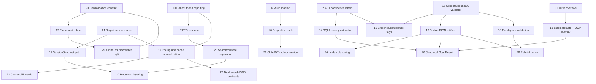

# Q-D — Adoption Sequencing Roadmap

> Iteration 7 of master consolidation. Cross-phase synthesis #5 of 6.
> Inputs: `cross-phase-matrix.md` (Q-B), `q-a-token-honesty.md` (Q-A), `q-c-composition-risk.md` (Q-C), `q-e-license-runtime.md` (Q-E).

## TL;DR
- Sequenced candidates: `28`; phase split = `P0: 9`, `P1: 10`, `P2: 6`, `P3: 3`. No Q-C survivor was later excluded by Q-E. [SOURCE: research/iterations/q-c-composition-risk.md:12-16] [SOURCE: research/iterations/q-e-license-runtime.md:11-11] [SOURCE: research/iterations/q-e-license-runtime.md:66-69]
- Foundational rails come first: detector/schema discipline, honest measurement, deterministic Stop-time summaries, and workflow scaffolds all unlock later memory, graph, and packaging work without challenging Public's split topology. [SOURCE: research/iterations/q-c-composition-risk.md:14-16] [SOURCE: research/iterations/q-a-token-honesty.md:104-125]
- First 3 fast wins: benchmark-honest token reporting, deterministic Stop-time summary computation, and graph/schema boundary hardening (`validate.py` + confidence labels). Those make later savings claims measurable before Public scales more ambitious work. [SOURCE: research/iterations/q-c-composition-risk.md:15-16] [SOURCE: research/iterations/q-a-token-honesty.md:115-125]

Dependency edges below are synthesis edges, not claims of current implementation coupling. They are derived from the charter's own cross-phase dependency examples plus the originating recommendation language in the phase packets. [SOURCE: scratch/deep-research-prompt-master-consolidation.md:103-105] [SOURCE: 002-codesight/research/research.md:469-481] [SOURCE: 003-contextador/research/research.md:273-283] [SOURCE: 004-graphify/research/research.md:560-563] [SOURCE: 004-graphify/research/research.md:730-736] [SOURCE: 005-claudest/research/research.md:395-405]

## Topologically-sorted roadmap

### Phase P0 — Fast wins (no deps, low risk, foundational)

| # | Candidate | Phase origin | Q-C risk | Q-E verdict | Effort | Touches | Evidence | depends-on |
|---|-----------|--------------|----------|-------------|--------|---------|----------|------------|
| 1 | Benchmark-honest token reporting | 003 | low | concept-transfer-only | S | Spec Kit Memory | [SOURCE: research/iterations/q-c-composition-risk.md:31-31] [SOURCE: research/iterations/q-a-token-honesty.md:115-125] [SOURCE: research/iterations/gap-closure-phases-3-4-5.json:11-62] | (none) |
| 2 | Deterministic summary computation at Stop time | 005 | low | mixed | S | Spec Kit Memory | [SOURCE: research/iterations/q-c-composition-risk.md:42-42] [SOURCE: 005-claudest/research/research.md:396-397] [SOURCE: research/iterations/gap-closure-phases-3-4-5.json:676-718] | (none) |
| 3 | `validate.py` schema-boundary validator | 004 | low | mixed | S | Code Graph / interchange | [SOURCE: research/iterations/q-c-composition-risk.md:36-36] [SOURCE: 004-graphify/research/research.md:730-730] | (none) |
| 4 | AST-first / regex-fallback / confidence labels | 002 | low | mixed | S | Code Graph | [SOURCE: research/iterations/q-c-composition-risk.md:23-23] [SOURCE: 002-codesight/research/research.md:471-471] | (none) |
| 5 | 4-phase consolidation contract | 005 | low | mixed | S | Spec Kit Memory | [SOURCE: research/iterations/q-c-composition-risk.md:44-44] [SOURCE: 005-claudest/research/research.md:399-399] | (none) |
| 6 | Generated `.mcp.json` scaffold plus setup hints | 003 | low | concept-transfer-only | S | activation surface | [SOURCE: research/iterations/q-c-composition-risk.md:30-30] [SOURCE: 003-contextador/research/research.md:277-279] | (none) |
| 7 | F1 fixture harness for detector regression | 002 | low | mixed | S | validation surface | [SOURCE: research/iterations/q-c-composition-risk.md:26-26] [SOURCE: 002-codesight/research/research.md:481-481] [SOURCE: research/iterations/gap-closure-phases-1-2.json:259-310] | (none) |
| 8 | Per-tool profile overlay split | 002 | low | mixed | M | static assistant artifacts | [SOURCE: research/iterations/q-c-composition-risk.md:24-24] [SOURCE: 002-codesight/research/research.md:473-473] [SOURCE: 002-codesight/research/research.md:716-717] | (none) |
| 9 | Hot-file ranking by incoming import count | 002 | low | mixed | S | Code Graph | [SOURCE: research/iterations/q-c-composition-risk.md:27-27] [SOURCE: 002-codesight/research/research.md:485-485] [SOURCE: 002-codesight/research/research.md:718-718] | (none) |

### Phase P1 — Build on P0

| # | Candidate | Phase origin | Q-C risk | Q-E verdict | Effort | Touches | Evidence | depends-on |
|---|-----------|--------------|----------|-------------|--------|---------|----------|------------|
| 10 | Graph-first PreToolUse hook | 004 | low | mixed | S | routing shim to Code Graph + CocoIndex | [SOURCE: research/iterations/q-c-composition-risk.md:33-33] [SOURCE: 004-graphify/research/research.md:561-561] [SOURCE: research/iterations/iteration-6.md:38-40] | Generated `.mcp.json` scaffold plus setup hints |
| 11 | Cached `context_summary` SessionStart fast path | 005 | low | mixed | S | Spec Kit Memory | [SOURCE: research/iterations/q-c-composition-risk.md:41-41] [SOURCE: 005-claudest/research/research.md:396-396] [SOURCE: research/iterations/iteration-6.md:38-40] | Deterministic summary computation at Stop time |
| 12 | Placement rubric for memory consolidation | 005 | low | mixed | S | Spec Kit Memory | [SOURCE: research/iterations/q-c-composition-risk.md:48-48] [SOURCE: 005-claudest/research/research.md:404-404] | 4-phase consolidation contract |
| 13 | Static artifacts as default + MCP as overlay | 002 | med | mixed | M | static artifacts + overlay projections | [SOURCE: research/iterations/q-c-composition-risk.md:25-25] [SOURCE: 002-codesight/research/research.md:475-475] | Per-tool profile overlay split |
| 14 | SQLAlchemy AST schema extraction | 002 | med | mixed | M | Code Graph | [SOURCE: research/iterations/q-c-composition-risk.md:28-28] [SOURCE: 002-codesight/research/research.md:720-720] | AST-first / regex-fallback / confidence labels |
| 15 | Evidence-tagging contract + `confidence_score` | 004 | med | mixed | M | Code Graph + CocoIndex | [SOURCE: research/iterations/q-c-composition-risk.md:32-32] [SOURCE: 004-graphify/research/research.md:560-560] [SOURCE: scratch/deep-research-prompt-master-consolidation.md:103-104] | `validate.py` schema-boundary validator; AST-first / regex-fallback / confidence labels |
| 16 | Stable JSON interchange artifact | 004 | med | mixed | M | interchange + Code Graph projections | [SOURCE: research/iterations/q-c-composition-risk.md:39-39] [SOURCE: 004-graphify/research/research.md:736-736] | `validate.py` schema-boundary validator |
| 17 | Runtime FTS capability cascade | 005 | med | mixed | M | Spec Kit Memory | [SOURCE: research/iterations/q-c-composition-risk.md:40-40] [SOURCE: 005-claudest/research/research.md:395-395] [SOURCE: research/iterations/gap-closure-phases-3-4-5.json:660-674] | Benchmark-honest token reporting |
| 18 | Two-layer cache invalidation | 004 | med | mixed | M | CocoIndex + Code Graph | [SOURCE: research/iterations/q-c-composition-risk.md:34-34] [SOURCE: 004-graphify/research/research.md:562-562] | `validate.py` schema-boundary validator |
| 19 | Per-tier pricing and cache normalization | 005 | med | mixed | M | Spec Kit Memory analytics | [SOURCE: research/iterations/q-c-composition-risk.md:45-45] [SOURCE: 005-claudest/research/research.md:400-401] [SOURCE: research/iterations/q-a-token-honesty.md:127-134] | Benchmark-honest token reporting; Deterministic summary computation at Stop time |

### Phase P2 — Build on P1

| # | Candidate | Phase origin | Q-C risk | Q-E verdict | Effort | Touches | Evidence | depends-on |
|---|-----------|--------------|----------|-------------|--------|---------|----------|------------|
| 20 | CLAUDE.md companion section pattern | 004 | low | mixed | S | assistant guidance surface | [SOURCE: research/iterations/q-c-composition-risk.md:35-35] [SOURCE: 004-graphify/research/research.md:563-563] | Graph-first PreToolUse hook |
| 21 | Cache-cliff metric | 005 | low | mixed | S | Spec Kit Memory analytics | [SOURCE: research/iterations/q-c-composition-risk.md:46-46] [SOURCE: 005-claudest/research/research.md:401-401] | Per-tier pricing and cache normalization |
| 22 | Dashboard JSON contracts | 005 | low | mixed | M | observability surface | [SOURCE: research/iterations/q-c-composition-risk.md:47-47] [SOURCE: 005-claudest/research/research.md:402-402] [SOURCE: research/iterations/q-a-token-honesty.md:123-125] | Per-tier pricing and cache normalization |
| 23 | Search/browse separation | 005 | low | mixed | S | Spec Kit Memory API | [SOURCE: research/iterations/q-c-composition-risk.md:49-49] [SOURCE: 005-claudest/research/research.md:405-405] | Runtime FTS capability cascade |
| 24 | Leiden clustering | 004 | med | mixed | M | Code Graph | [SOURCE: research/iterations/q-c-composition-risk.md:37-37] [SOURCE: 004-graphify/research/research.md:573-573] | Stable JSON interchange artifact |
| 25 | Auditor vs discoverer split | 005 | med | mixed | M | Spec Kit Memory quality workflow | [SOURCE: research/iterations/q-c-composition-risk.md:43-43] [SOURCE: 005-claudest/research/research.md:398-399] | 4-phase consolidation contract; Placement rubric for memory consolidation |

### Phase P3 — Speculative or upstream-blocked

| # | Candidate | Phase origin | Q-C risk | Q-E verdict | Effort | Touches | Evidence | depends-on |
|---|-----------|--------------|----------|-------------|--------|---------|----------|------------|
| 26 | Single-canonical-`ScanResult` orchestration shape | 002 | high | mixed | L | CocoIndex + Code Graph + Spec Kit Memory | [SOURCE: research/iterations/q-c-composition-risk.md:22-22] [SOURCE: 002-codesight/research/research.md:469-469] [SOURCE: research/iterations/iteration-6.md:40-42] | AST-first / regex-fallback / confidence labels; Per-tool profile overlay split; Static artifacts as default + MCP as overlay; Hot-file ranking by incoming import count; SQLAlchemy AST schema extraction; Stable JSON interchange artifact |
| 27 | Config-gated bootstrap layering | 003 | high | concept-transfer-only | L | CocoIndex + Code Graph + Spec Kit Memory | [SOURCE: research/iterations/q-c-composition-risk.md:29-29] [SOURCE: 003-contextador/research/research.md:273-275] [SOURCE: research/iterations/iteration-6.md:40-42] | Generated `.mcp.json` scaffold plus setup hints; Cached `context_summary` SessionStart fast path; Search/browse separation |
| 28 | Modality-aware rebuild policy layer | 004 | high | mixed | L | CocoIndex + Code Graph + orchestration | [SOURCE: research/iterations/q-c-composition-risk.md:38-38] [SOURCE: 004-graphify/research/research.md:734-734] [SOURCE: research/iterations/iteration-6.md:40-42] | Two-layer cache invalidation; Stable JSON interchange artifact |

## Dependency graph

## Cycle detection

No dependency cycles were found under the explicit edges above, so no break was required. The late-phase items stay late because they depend on already-proven adapters, not because of circular prerequisites. [SOURCE: research/iterations/q-c-composition-risk.md:133-151] [SOURCE: research/iterations/iteration-6.md:38-42]

## Per-phase effort summary

| Phase | # Candidates | Total effort | Earliest start | Required prerequisites |
|---|---:|---|---|---|
| P0 | 9 | `7S + 2M` | now | none |
| P1 | 10 | `3S + 7M` | after P0 | measurement rails, Stop-time producer, schema rails, activation scaffold |
| P2 | 6 | `3S + 3M` | after P1 | proven hooks, analytics normalization, stable graph artifact, consolidation policy |
| P3 | 3 | `3L` | after P2 | adapter proof, explicit topology review, and any upstream license clarification needed for direct source lift decisions |

## Sequencing rationale

This order follows four rules from the charter. First, the roadmap starts with candidates that unlock multiple later moves without forcing a topology change. That is why P0 is mostly rails: detector confidence labeling, schema validation, honest token reporting, deterministic summary production, and workflow scaffolds. Each enables later candidates while staying inside one owner surface. [SOURCE: scratch/deep-research-prompt-master-consolidation.md:131-135] [SOURCE: research/iterations/q-c-composition-risk.md:14-16]

Second, low-risk single-surface work lands before medium-risk cross-surface adapters. Q-C already showed that Public wins when improvements reinforce its semantic/structural/memory split, and loses when a candidate tries to collapse that split into one super-surface. That is why the three high-risk entries stay isolated in P3. [SOURCE: research/iterations/q-c-composition-risk.md:12-16] [SOURCE: research/iterations/iteration-6.md:28-29] [SOURCE: research/iterations/iteration-6.md:40-42]

Third, measurement comes early because Q-A made it explicit that Public should not scale savings claims it cannot prove. P0 and early P1 therefore front-load honest reporting, regression harnesses, deterministic summary production, and normalized analytics before later dashboard or orchestration work. [SOURCE: research/iterations/q-a-token-honesty.md:13-14] [SOURCE: research/iterations/q-a-token-honesty.md:115-125] [SOURCE: research/iterations/q-a-token-honesty.md:127-134]

Fourth, already-validated patterns beat speculative ones. The early sequence privileges candidates whose underlying reality was re-checked during iter-2/3: CodeSight's F1 harness is real, Contextador's synthetic token story is now closed negatively and therefore motivates honest reporting, Claudest's FTS fallback is real, and Public's current producer gap is already documented, which makes Stop-time producer work a genuine prerequisite rather than a guess. [SOURCE: research/iterations/gap-closure-phases-1-2.json:259-310] [SOURCE: research/iterations/gap-closure-phases-3-4-5.json:11-62] [SOURCE: research/iterations/gap-closure-phases-3-4-5.json:660-674] [SOURCE: research/iterations/gap-closure-phases-3-4-5.json:676-718]
