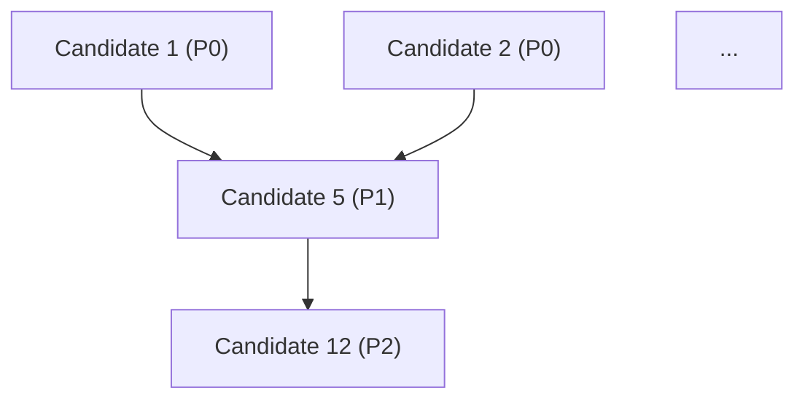

# ITERATION 7 — Q-D Adoption Sequencing + Q-F Killer Combos (combined)

You are **codex** (`gpt-5.4`, reasoning effort `high`), running **iteration 7 of 12 max**.

This is the **final cross-phase synthesis** iteration. After this, only iter-8 (final assembly) remains. Per charter §3.1, Q-D and Q-F are the natural last pair: Q-D needs Q-B/Q-C/Q-E to be done (✓), and Q-F needs all five prior questions answered (✓).

## Charter (read fully first)

`scratch/deep-research-prompt-master-consolidation.md`

## Folder layout

```
research/
├── deep-research-{config.json, state.jsonl, strategy.md, dashboard.md}  # state (root)
├── phase-1-inventory.json                                                # foundation (root)
├── cross-phase-matrix.md                                                 # iter-4 deliverable
├── iterations/
│   ├── iteration-{1,2,3,4,5,6}.md
│   ├── gap-closure-phases-{1-2, 3-4-5}.json
│   ├── q-a-token-honesty.md
│   ├── q-c-composition-risk.md
│   ├── q-e-license-runtime.md
│   └── (iter-7 outputs land here)
└── (final deliverables — root in iter 8+)
```

## Prior iteration outputs to READ before starting

- `research/cross-phase-matrix.md` — iter-4 (capability scores, dominance counts)
- `research/iterations/q-a-token-honesty.md` — iter-5 (honesty scores, recommended methodology)
- `research/iterations/q-e-license-runtime.md` — iter-6 (gating verdicts: 0 portable / 2 concept / 3 mixed)
- `research/iterations/q-c-composition-risk.md` — iter-6 (28 candidates: 16 low / 9 med / 3 high)
- `research/iterations/iteration-6.md` — handoff notes for iter-7

You may quote those files DIRECTLY since they already contain source-grounded evidence.

## Spec folder (pre-approved, skip Gate 3)

`/Users/michelkerkmeester/MEGA/Development/Code_Environment/Public/.opencode/specs/system-spec-kit/026-graph-and-context-optimization/001-research-graph-context-systems`

`--cd` set here. **Permission:** read all 5 phase folders + `external/` + Public's `.opencode/`.

---

## Iteration 7 mission, part A — Q-D Adoption Sequencing (charter §2.4 Q-D + §4.1 §8)

Build a **topologically-sorted adoption roadmap** over the 28 candidates that survived Q-C (with explicit `depends-on:` edges).

### Sequencing rules

1. **Eligible pool:** the 28 Q-C candidates (low + med + high risk). Exclude only those that are explicitly *excluded by Q-E* (none of the 28 should be in this category by construction, but verify).
2. **Order by:**
   - First, candidates that **enable** other candidates (foundational dependencies) come first.
   - Second, candidates with **low composition risk** come before med/high.
   - Third, candidates that **address Q-A measurement gaps** (so Public can prove its own savings) come before candidates whose savings can't be measured yet.
   - Fourth, candidates that the **iter-2/3 gap closures already validated** as real (not just speculation) come before speculative ones.
3. **Dependency edges:** for each candidate, list explicit `depends-on:` edges to other candidates. The example dependency graph from charter §2.4 Q-D was:
   - "001's hook recommendations need 005's auditor/parser"
   - "003's pointer benchmark needs 002's static structure"
   - "004's evidence tagging needs schema work in Code Graph"
   Use these as starting points but don't be limited to them.
4. **Phasing:** group the roadmap into phases (P0/P1/P2/P3) where:
   - **P0** = no dependencies, low risk, foundational, fast wins
   - **P1** = depends on P0, low/med risk
   - **P2** = depends on P1, med risk OR speculative
   - **P3** = depends on P2 OR high risk OR requires upstream license verification

### Cycle detection

If you find a dependency cycle, BREAK it explicitly and document why. Topological sort should be deterministic.

---

## Iteration 7 mission, part B — Q-F Killer Combo Analysis (charter §2.4 Q-F + §4.1 §10)

Per charter: surface the **top 3** pairwise or triple combinations across the 5 systems that yield **more value than any single adoption**. The charter gives one example: "Graphify's confidence vocabulary + Claudest's FTS cascade + CodeSight's per-tool projections."

### What makes a "killer combo"

1. **Synergy** — the value of A+B (or A+B+C) exceeds the sum of value(A) + value(B) — there's a multiplier effect.
2. **Compatible composition risk** — components must be individually low/med risk OR have a concrete plan to reduce high-risk components to med via adapter design.
3. **Compatible Q-E verdicts** — at least one component must be source-portable, OR all components must be concept-transferable cleanly.
4. **Maps to Q-A measurement** — the combo must produce measurable savings under Public's recommended methodology (iter-5).

### What to produce per combo

For each of the **top 3 combos**:

| Field | What it means |
|---|---|
| Title | Imperative voice, ≤80 chars |
| Components | 2-3 candidates with origin phase + Q-C risk + Q-E verdict |
| Synergy hypothesis | Why A+B is more than A+B (≤3 sentences) |
| Evidence | Citations from prior deliverables (not new external reads, ideally) |
| Measurement plan | How Public would prove it works (uses Q-A methodology) |
| Effort estimate | S / M / L (S = days, M = weeks, L = months) |
| Prerequisites | Other candidates that must land first (cite Q-D phase) |
| Composition risk (combo-level) | low/med/high, often = max(component risks) |
| Killer-quality score | 1-10 with one-line justification |

### Anti-patterns to avoid

- Don't propose a combo where one component does the heavy lifting and the others are decoration
- Don't propose combos that require breaking Public's split topology
- Don't propose combos that depend on AGPL source from Contextador

---

## Output 1 — `research/iterations/q-d-adoption-sequencing.md`

```markdown
# Q-D — Adoption Sequencing Roadmap

> Iteration 7 of master consolidation. Cross-phase synthesis #5 of 6.
> Inputs: cross-phase-matrix.md (Q-B), q-a-token-honesty.md (Q-A), q-c-composition-risk.md (Q-C), q-e-license-runtime.md (Q-E).

## TL;DR
- (P0/P1/P2/P3 counts; foundational dependencies; first 3 fast wins)

## Topologically-sorted roadmap

### Phase P0 — Fast wins (no deps, low risk, foundational)

| # | Candidate | Phase origin | Q-C risk | Q-E verdict | Effort | Touches | Evidence | depends-on |
|---|-----------|--------------|----------|-------------|--------|---------|----------|------------|
| 1 | … | 005 | low | mixed | S | Spec Kit Memory | [SOURCE: …] | (none) |
| … |

### Phase P1 — Build on P0

| # | Candidate | … | depends-on |
|---|-----------|---|------------|

### Phase P2 — Build on P1

…

### Phase P3 — Speculative or upstream-blocked

…

## Dependency graph (ASCII or Mermaid)



(if Mermaid feels heavy, use ASCII like P0_1 → P1_5)

## Cycle resolution

(only if any cycles were found and broken)

## Per-phase effort summary

| Phase | # Candidates | Total effort | Earliest start | Required prerequisites |
|---|---|---|---|---|
| P0 | … | … | now | none |
| P1 | … | … | after P0 | … |
| P2 | … | … | after P1 | … |
| P3 | … | … | after P2 | upstream license verification |

## Sequencing rationale

≤500 words explaining why this order, citing the Q-B/Q-A/Q-C/Q-E inputs.
```

---

## Output 2 — `research/iterations/q-f-killer-combos.md`

```markdown
# Q-F — Killer-Combo Analysis

> Iteration 7 of master consolidation. Cross-phase synthesis #6 of 6.
> Top 3 multi-system combinations that exceed single-system adoption value.

## TL;DR
- 3 combos surfaced; their killer-scores are X / Y / Z.

## Combo 1 — [Imperative title]
**Components:** [Candidate A from phase X] + [Candidate B from phase Y] (+ [Candidate C from phase Z])
**Synergy hypothesis:** (≤3 sentences)
**Why this beats either component alone:** (≤3 sentences)
**Evidence:** [SOURCE: research/iterations/...] [SOURCE: phase-X/...]
**Measurement plan (Q-A grounded):** (≤3 sentences)
**Effort:** S/M/L
**Prerequisites (from Q-D):** Phase P0/P1 candidates X, Y
**Composition risk (combo-level):** low/med/high
**Killer-quality score:** N/10 — (one-line justification)

## Combo 2 — [Title]
…

## Combo 3 — [Title]
…

## Combos considered but rejected

A short list (≤5) of combos you considered but didn't make the top 3, with one-line reason each.

## Cross-cutting observation

What pattern unifies the top 3 combos? (1 paragraph)
```

---

## Output 3 — `research/iterations/iteration-7.md` (≤400 lines)

```markdown
# Iteration 7 — Q-D + Q-F combined

## Method
- Inputs: cross-phase-matrix.md, q-a-token-honesty.md, q-c-composition-risk.md, q-e-license-runtime.md
- New external reads: (probably zero — this is synthesis-only)

## Q-D summary
| Phase | Candidates | Effort |

## Q-F summary
| Combo | Score | Effort |

## Surprises
- ≤6 bullets

## Handoff to iteration 8 (Final assembly)
- Where each piece will plug into research.md (cite section numbers)
- What still needs to be assembled vs already-written
```

---

## Output 4 — append to `research/deep-research-state.jsonl`

```json
{"event":"iteration_complete","iteration":7,"timestamp":"<ISO-8601-UTC>","worker":"codex/gpt-5.4/high","scope":"q_d_sequencing_plus_q_f_combos","candidates_sequenced":<int>,"phases_p0":<int>,"phases_p1":<int>,"phases_p2":<int>,"phases_p3":<int>,"combos_surfaced":3,"top_combo_score":<int>,"composite_score_estimate":<0..1>,"new_info_ratio":<0..1>,"stop_reason":"iteration_7_done","next_iteration_ready":true,"notes":"<≤200 chars>"}
```

---

## Final stdout line (mandatory)

```
ITERATION_7_COMPLETE qd=p0:<n>/p1:<n>/p2:<n>/p3:<n> qf=combos:3 top_score=<n>/10
```

---

## Constraints

- **LEAF-only** — no sub-agent dispatch
- Do NOT modify earlier deliverables
- Do NOT modify any phase folder
- Output files in `research/iterations/`; state line in `research/` root
- Every claim must trace to at least one `[SOURCE: …]` citation (synthesis or source)
- For synthesis-of-synthesis citations, use `[SOURCE: research/iterations/q-c-composition-risk.md:LL-LL]` etc.
- Cycle detection in Q-D: if any dependency cycle exists, BREAK it explicitly with rationale
- For Q-F: do NOT exceed 3 combos. Killer-quality must be defensible.
- Q-F scoring rubric: 9-10 = strict synergy proof; 7-8 = strong synergy hypothesis with evidence; 5-6 = compelling but speculative; below 5 = drop the combo
- Effort rubric: S = 1-7 days; M = 1-4 weeks; L = 1-3 months

## When done

Exit. Do NOT start iteration 8. Claude orchestrator will validate and dispatch iteration 8 (Final assembly: research.md, findings-registry.json, recommendations.md).
